--------------------
austechia is a Jupyter notebook that provides some example code of how to plot trees imported with baltic.

------------

Copyright 2016 [Gytis Dudas](https://twitter.com/evogytis). Licensed under a [Creative Commons Attribution-NonCommercial-ShareAlike 4.0 International License](http://creativecommons.org/licenses/by-nc-sa/4.0/).


```python
%matplotlib inline

try:
    import imp
    bt = imp.load_source('baltic', '/Users/evogytis/Documents/baltic/baltic.py')
except:
    import importlib.machinery
    import importlib.util
    loader = importlib.machinery.SourceFileLoader('baltic','/Users/evogytis/Documents/baltic/baltic.py')
    spec = importlib.util.spec_from_loader(loader.name, loader)
    bt = importlib.util.module_from_spec(spec)
    loader.exec_module(bt)
```

## The classes of baltic
------------

There are 3 main classes in baltic:
- node = internal branches
- leaf = external branches
- tree = the entirety of the tree

The node and leaf classes are similar and share many parameters in common, such as branch length, height, position in absolute time, traits, parents, x and y coordinates and index of the character which defined them in the tree string. They differ in that the node class contains a list of its children objects for tree traversals, called children and a list of all tips that descend from it eventually, called leaves. Node class also contains parameters like childHeight and numChildren which are less important. The leaf class contains two name variables: numName and name. numName corresponds to whatever was used to designate the tip in the tree string. name can be set later and is meant to handle scenarios where the tree string contains tip names encoded as numbers (Nexus format), which can be decoded into name, rather than overwriting whatever was caught in numName.

The tree class wraps leaf and node classes together by performing operations to build, manipulate, visualise and analyse the full tree data structure. The recommended way of interacting with the tree is via the Objects list, which is a flat list of all branches in the tree.

baltic now also has a clade class. They are introduced when a subtree is collapsed and pose as tips for tree traversals.

## The function
------------

At the top is the make_tree function. Given a valid tree string it will transform the information contained in the tree string into an actual tree data structure. If there are elements within the tree string that it can't parse it will warn the user of this. The most common reasons for this are unexpected characters in branch labels or something unexpected in tip names (particularly illegal characters: whitespace, parentheses, commas, semicolons, etc).


```python
treestring="(('taxon_A'[&comment=\"stuff\"]:1.0,'taxon_B':1.0)[&comment_too=\"stuff_too\"]:1.0,'taxon_C':2.0);"
bt_tree_object=bt.make_tree(treestring,verbose=True)
bt_tree_object.traverse_tree() ## required to set heights
bt_tree_object.treeStats() ## report stats about tree
bt_tree_object.setAbsoluteTime(2018.0) ## set absolute time of all branches by specifying date of most recent tip

for k in bt_tree_object.Objects: ## iterate over a flat list of branches
    print('branch unique id: %s branch height: %.2f decimal date: %s'%(k.index,k.height,k.absoluteTime))
    
    if len(k.traits)>0: ## branch has comments
        print('branch has annotations: %s'%(', '.join(['(key: %s value: %s)'%(key,k.traits[key]) for key in k.traits])))
    
    if k.branchType=='node': ## if branch is internal
        print('branch is internal, with %s children and is the ancestor to %s'%(len(k.children),', '.join(k.leaves)))
    
    elif k.branchType=='leaf': ## otherwise if branch is external
        print('branch is external, named %s in tree string (converted name: %s)'%(k.numName,k.name))
```

    0 adding node
    1 adding node
    2 adding leaf (non-BEAST) taxon_A
    11 comment: &comment="stuff"
    adding branch length (29) 1.000000
    34 adding leaf (non-BEAST) taxon_B
    adding branch length (43) 1.000000
    48 comment: &comment_too="stuff_too"
    adding branch length (74) 1.000000
    79 adding leaf (non-BEAST) taxon_C
    adding branch length (88) 2.000000
    
    Tree height: 2.000000
    Tree length: 5.000000
    strictly bifurcating tree
    annotations present
    
    Numbers of objects in tree: 5 (2 nodes and 3 leaves)
    
    branch unique id: 0 branch height: 0.00 decimal date: 2016.0
    branch is internal, with 2 children and is the ancestor to taxon_B, taxon_A, taxon_C
    branch unique id: 1 branch height: 1.00 decimal date: 2017.0
    branch has annotations: (key: comment_too value: stuff_too)
    branch is internal, with 2 children and is the ancestor to taxon_B, taxon_A
    branch unique id: 2 branch height: 2.00 decimal date: 2018.0
    branch has annotations: (key: comment value: stuff)
    branch is external, named taxon_A in tree string (converted name: None)
    branch unique id: 34 branch height: 2.00 decimal date: 2018.0
    branch is external, named taxon_B in tree string (converted name: None)
    branch unique id: 79 branch height: 2.00 decimal date: 2018.0
    branch is external, named taxon_C in tree string (converted name: None)


## Tree import
-----------
baltic was primarily written to handle FigTree files with rich branch annotations. These nexus files can be loaded via the ``loadNexus()`` function, or if you have a newick tree you can use ``loadNewick``. ``loadNexus`` accepts regular expression to find dates for tips if they are encoded in the names, find tree strings (if using nexus files not generated in BEAST).


```python
from IPython.display import HTML
import re
import copy

import matplotlib as mpl
from matplotlib import pyplot as plt
import matplotlib.patheffects as path_effects
from matplotlib.gridspec import GridSpec
from matplotlib.patches import Polygon

import numpy as np
from scipy.special import binom
import bezier
import itertools
import requests

try:
    from StringIO import StringIO as sio
    from cStringIO import StringIO as csio
except ImportError:
    from io import StringIO as sio
    from io import BytesIO as csio

# from StringIO import StringIO
from Bio import Phylo
# from cStringIO import StringIO as cStringIO

typeface='Helvetica Neue'
mpl.rcParams['font.weight']=300
mpl.rcParams['axes.labelweight']=300
mpl.rcParams['font.family']=typeface
mpl.rcParams['font.size']=22

def Bezier_control(pointA,pointB,height,frac):
    """ 
    Given a line defined by 2 points A & B, 
    find a third point at a given distance (height) that defines a line perpendicular to line AB which intercepts AB at fraction (frac) along AB.
    Equation derived by Luiz Max Fagundes de Carvalho (University of Edinburgh).
    """
    x1,y1=pointA
    x2,y2=pointB

    sign=1
    if x1>x2:
        sign=-1

    slope = (y2-y1) / (x2-x1)
    d=np.sqrt((y2-y1)**2 + (x2-x1)**2) ## distance between points
    
    h=np.sqrt(height**2+(d*frac)**2) ## distance between desired height and point along line

    n1=x1+h*np.cos(np.arctan(height/float(d)/frac)+np.arctan(slope))*sign ## magic
    n2=y1+h*np.sin(np.arctan(height/float(d)/frac)+np.arctan(slope))*sign

    return (n1,n2) ## return third point's coordinate

address='https://raw.githubusercontent.com/evogytis/fluB/master/data/mcc%20trees/InfB_NPt_ALLs1.mcc.tre' ## address of example tree
fetch_tree = requests.get(address) ## fetch tree
treeFile=sio(fetch_tree.text) ## stream from repo copy

# ll=bt.loadNexus('/Users/evogytis/Dropbox/Jupyter_notebooks/Biohub/California_mosquitoes/timetree_WuhanMosquitoVirus6/WMV6_genome_dated.WMV6_gp64_dated.mcc.tree',absoluteTime=False)

ll=bt.loadNexus(treeFile,tip_regex='_([0-9\-]+)$') ## treeFile here can alternatively be a path to a local file
ll.treeStats() ## report stats about tree

path='<iframe style="border: 0; width: 400px; height: 345px;" src="https://bandcamp.com/EmbeddedPlayer/album=2074815275/size=large/bgcol=ffffff/linkcol=333333/artwork=small/track=42188979/transparent=true/" seamless><a href="http://obsrr.bandcamp.com/album/nustebusiam-neb-ti">NUSTEBUSIAM NEBUTI by OBSRR</a></iframe>'

print('Done!')
HTML(path)
```

    
    Tree height: 29.430115
    Tree length: 451.887106
    strictly bifurcating tree
    annotations present
    
    Numbers of objects in tree: 903 (451 nodes and 452 leaves)
    
    Done!


<iframe style="border: 0; width: 400px; height: 345px;" src="https://bandcamp.com/EmbeddedPlayer/album=2074815275/size=large/bgcol=ffffff/linkcol=333333/artwork=small/track=42188979/transparent=true/" seamless><a href="http://obsrr.bandcamp.com/album/nustebusiam-neb-ti">NUSTEBUSIAM NEBUTI by OBSRR</a></iframe>


## Plotting trees
-----------
As long as the drawTree() function has been called from the tree object it's possible to draw out the tree by iterating over every branch in the tree object and plotting it. It remains up to the user as to how the tree gets plotted in terms of colour, branch width, tip sizes, tip labels, etc.


```python
fig,ax = plt.subplots(figsize=(10,20),facecolor='w')

x_attr=lambda k: k.absoluteTime ## x coordinate of branches will be absoluteTime attribute
c_func=lambda k: 'indianred' if k.traits['PB1']=='V' else 'steelblue' ## colour of branches
s_func=lambda k: 50-30*k.height/ll.treeHeight ## size of tips
z_func=lambda k: 100

cu_func=lambda k: 'k' ## for plotting a black outline of tip circles
su_func=lambda k: 2*(50-30*k.height/ll.treeHeight) ## black outline in twice as big as tip circle 
zu_func=lambda k: 99
ll.plotTree(ax,x_attr=x_attr,colour_function=c_func) ## plot branches
ll.plotPoints(ax,x_attr=x_attr,size_function=s_func,colour_function=c_func,zorder_function=z_func) ## plot circles at tips
ll.plotPoints(ax,x_attr=x_attr,size_function=su_func,colour_function=cu_func,zorder_function=zu_func) ## plot circles under tips (to give an outline)

ax.set_ylim(-5,ll.ySpan+5)
plt.show()
```


    
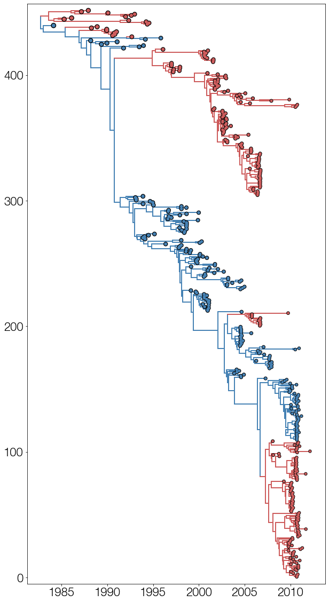
    


## Collapsing branches
------
Branches can be collapsed based on trait values or attribute values that don't satisfy a function. The returned tree object then needs to be redrawn using the drawTree() method to get new y positions for branches.


```python
fig,ax = plt.subplots(figsize=(10,20),facecolor='w')

cmap=mpl.cm.viridis

cc=ll.collapseBranches(lambda k: k.traits['posterior'] <= 0.5) ## collapse branches below 0.5 posterior probability
# cc=ll.collapseBranches(lambda k: k.index>1000000) ## collapse branches whose index in tree string are above 1 million
cc.sortBranches() ## sort branches, also redraws tree

print(len(ll.Objects),len(cc.Objects)) ## check how many branches were collapsed

x_attr=lambda k: k.absoluteTime
c_func=lambda k: cmap(k.height/ll.treeHeight) ## colour gets determined by height of branch
s_func=lambda k: 20+30*k.height/ll.treeHeight
z_func=lambda k: 100

pos_func=lambda k: (k.absoluteTime,k.y) ## where to position text
target_func=lambda k: k.branchType=='node' ## only target nodes
text_func=lambda k: '%.2f'%(k.traits['posterior']) ## what text is plotted
kwargs={'va':'top','ha':'right','size':14} ## kwargs for text

cu_func=lambda k: 'k'
su_func=lambda k: 2*(20+30*k.height/ll.treeHeight)
zu_func=lambda k: 99

cc.plotTree(ax,x_attr=x_attr,colour_function=c_func) ## tree
cc.plotPoints(ax,x_attr=x_attr,size_function=s_func,colour_function=c_func,zorder_function=z_func) ## tips
cc.plotPoints(ax,x_attr=x_attr,size_function=su_func,colour_function=cu_func,zorder_function=zu_func) ## tip outlines
cc.addText(ax,position=pos_func,target=target_func,text=text_func,**kwargs) ## text

ax.set_ylim(-5,cc.ySpan+5)
plt.show()
```

    903 644


    
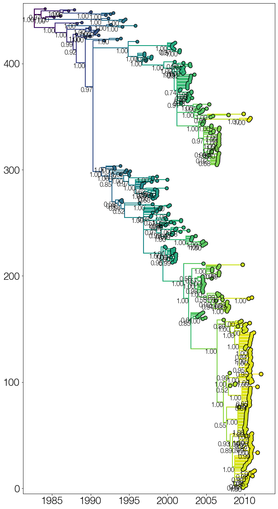
    


## Extract trait subtrees, fix subtrees
-------
The following cell showcases code to decompose trees with trait labels into individual subtrees, which are recovered from within-trait tree traversals. Occasionally it will yield subtrees with only one valid child (i.e. a single tip) and multitype trees.


```python
traitName='PB1'
branchWidth=2
tipSize=30

ll.root.parent.traits[traitName]='ancestor' ## add fake trait to root of the tree
print(ll.root.absoluteTime,ll.root.parent.index)
tree_strings={'Y':[],'V':[],'ancestor':[]}
subtype_trees={'Y':[],'V':[],'ancestor':[]}

for l in ll.Objects:
    k=l
    kp=l.parent
    
    ## get current node's and its parent's trait states
    kloc=k.traits[traitName]
    if traitName in k.parent.traits:
        kploc=kp.traits[traitName]
        kpc=kploc
    else:
        kploc='ancestor'
        kpc='ancestor'

    kc=kloc
    
    ## if states do not match
    if kc!=kpc:
        traverse_condition=lambda w:w.traits[traitName]==kc
        print('subtree resulting from %s>%s switch, traversing within %s'%(kpc,kc,kc))
        subtree=ll.subtree(k,traverse_condition=traverse_condition) ## this function returns a new baltic object that contains a trait-traversed subtree, starting from node k, for as long as the traversal stays within the starting trait value state
        subtree.traverse_tree()
#         subtree.drawTree(verbose=True)
        subtree.sortBranches()
        tree_strings[kc].append(subtree.toString()) ## remember subtree string, subtree object itself
        subtype_trees[kc].append((kpc,subtree))
            
print('Done!')
```

    1982.7228900152938 Root
    subtree resulting from ancestor>Y switch, traversing within Y
    subtree resulting from Y>V switch, traversing within V
    subtree resulting from Y>V switch, traversing within V
    subtree resulting from Y>V switch, traversing within V
    subtree resulting from Y>V switch, traversing within V
    subtree resulting from Y>V switch, traversing within V
    subtree resulting from Y>V switch, traversing within V
    subtree resulting from Y>V switch, traversing within V
    Done!


## Tree spectrum
--------
This next bit plots every extracted subtree onto a single plot.


```python
fig,ax = plt.subplots(figsize=(10,15),facecolor='w')

traitName='PB1'
tipSize=20

cumulative_y=0

x_attr=lambda k: k.absoluteTime
c_func=lambda k: 'indianred' if k.traits[traitName]=='V' else 'steelblue'
s_func=lambda k: tipSize
z_func=lambda k: 100

su_func=lambda k: tipSize+30
cu_func=lambda k: 'k'
zu_func=lambda k: 99

for subtype in ['V','Y']: ## iterate over trait values
    for t,tr in enumerate(sorted(subtype_trees[subtype],key=lambda x:(-x[1].root.absoluteTime,len(x[1].Objects)))): ## iterate over extracted subtrees sorted according to their root height and their size
        origin,loc_tree=tr ## get origin of subtree, subtree itself
        
        y_attr=lambda k: k.y+cumulative_y
        
        loc_tree.plotTree(ax,x_attr=x_attr,y_attr=y_attr,colour_function=c_func)
        loc_tree.plotPoints(ax,x_attr=x_attr,y_attr=y_attr,size_function=s_func,
                            colour_function=c_func,zorder_function=z_func)
        loc_tree.plotPoints(ax,x_attr=x_attr,y_attr=y_attr,size_function=su_func,
                            colour_function=cu_func,zorder_function=zu_func)
        
        oriC='indianred' if origin=='V' else 'steelblue'
        
        oriX=loc_tree.root.absoluteTime
        oriY=loc_tree.root.y+cumulative_y
        
        ax.scatter(oriX,oriY,100,facecolor=oriC,edgecolor='w',lw=1,zorder=200) ## add big circle at base of tree to indicate origin
        cumulative_y+=loc_tree.ySpan+5 ## increment y displacement
        
ax.xaxis.tick_bottom()
ax.yaxis.tick_left()

[ax.spines[loc].set_visible(False) for loc in ['top','right','left']]

ax.tick_params(axis='y',size=0)
ax.set_yticklabels([])
ax.set_ylim(-5,cumulative_y)

plt.show()
```


    
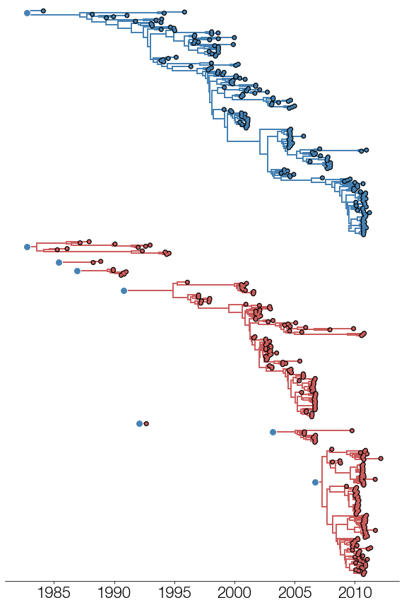
    


## Reduced trees
--------
This bit shows how to recover and plot reduced trees, which have a subset of the tips from the full tree, but preserve the evolutionary history that left over tips descend from.


```python
fig,ax = plt.subplots(figsize=(10,15),facecolor='w')

traitName='PB1'
tipSize=20

cumulative_y=0
keep_tips=[k for k in ll.Objects if k.branchType=='leaf' and k.traits['PB1']=='V'] ## list of leaf objects that will remain in the tree
reduced_tree=ll.reduceTree(keep_tips) ## retrieve a reduced tree (multitype by default)

x_attr=lambda k: k.absoluteTime
c_func=lambda k: 'indianred' if k.traits['PB1']=='V' else 'steelblue'
s_func=lambda k: tipSize
z_func=lambda k: 100

cu_func=lambda k: 'k'
su_func=lambda k: tipSize*2
zu_func=lambda k: 99

reduced_tree.plotTree(ax,x_attr=x_attr,colour_function=c_func)
reduced_tree.plotPoints(ax,x_attr=x_attr,size_function=s_func,colour_function=c_func,zorder_function=z_func)
reduced_tree.plotPoints(ax,x_attr=x_attr,size_function=su_func,colour_function=cu_func,zorder_function=zu_func)

ax.xaxis.tick_bottom()
ax.yaxis.tick_left()

[ax.spines[loc].set_visible(False) for loc in ['top','right','left']]

ax.tick_params(axis='y',size=0)
ax.set_yticklabels([])
ax.set_ylim(-5,reduced_tree.ySpan+5)

plt.show()
```


    
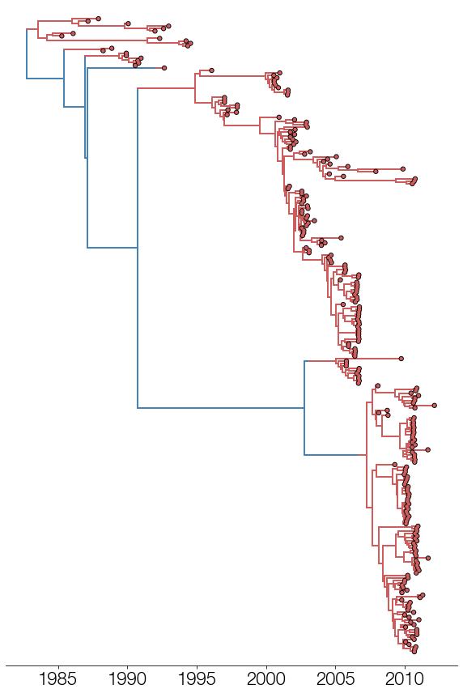
    


## Turning a tree data structure into a string

baltic can convert the data structure contained within the tree class to a tree string, with options to include the numName (the name of the tip as it appeared in the tree string) or the name attribute (if tips were decoded from their BEAST encoding) for tips and the inclusion of BEAST annotations.


```python
traitCombos=[['posterior'],None,['PB1','PB2','HA','PB1.set','PB1.set.prob'],['length','length_95%_HPD'],['height','height_95%_HPD']]
numNames=[True,False,True,False,True]

for subtree,traitCombo,outputWithNumber in zip(subtype_trees['V'],traitCombos,numNames):
    origin,sbtr=subtree
    sbtr.singleType() ## within-trait traversal may result in multitype trees - many software packages won't take those, so we're turning each subtree into a singletype tree

    print('Number of objects in subtree: %d, annotations to include: %s, use number encoding for tips: %s'%(len(sbtr.Objects),traitCombo,outputWithNumber))

    print('%s\n\n'%(sbtr.toString(traits=traitCombo,numName=outputWithNumber,nexus=True,verbose=False))) ## can output to a minimal NEXUS format for viewing in figtree with correct trait parsing
    
    
```

    Number of objects in subtree: 11, annotations to include: ['posterior'], use number encoding for tips: True
    #NEXUS
    Begin trees;
    tree TREE1 = [&R] (('16':0.519606,('15':0.292285,('84':0.896462,('285':0.332987,('150':0.313269,'425':0.065022)[&posterior=0.28885679368959005]:0.081792)[&posterior=1.0]:0.330872)[&posterior=1.0]:0.458146)[&posterior=0.22130874347294746]:0.230951)[&posterior=1.0]:2.477703)[&posterior=1.0]:1.522882;
    End;
    
    
    Number of objects in subtree: 1, annotations to include: None, use number encoding for tips: False
    #NEXUS
    Begin trees;
    tree TREE1 = [&R] ('B/Hong_Kong/02/1993_1993-02-15'[&PB1r_95%_HPD={0.005823036533472951,0.02926533632025781},N=0.0005554938340184424,height_range={19.028062970568026,19.875925534207536},NAr_range={0.002206763646509615,0.0930354017291562},height_95%_HPD={19.028062970568026,19.843586489497174},length=0.6518061181583787,HA.set.prob={1.0},NA.set.prob={1.0},height=19.45518483902433,IB_NP.rate_median=0.0013776642319987807,NAr_95%_HPD={0.006222224224297037,0.0500559735988054},NS.prob=1.0,NAr_median=0.02385448977745395,PB2="V",PA="V",PAr_95%_HPD={0.01084674361354805,0.11791381830922938},HAr_median=0.018763308478078337,NS="V",height_median=19.477217860959197,S=0.9784468392400845,NSr=0.0545824712285908,MP="V",PA.prob=1.0,PAr_range={0.0029766775028430286,0.23648318369682678},N_range={0.0,2.0},IB_NP.rate_range={0.00023084440014355535,0.005731154054795597},PB2r=0.013937360283102355,NA.set={"V"},IB_NP.rate=0.001492119041754685,PA.set={"V"},length_median=0.558741022065881,NSr_range={0.009099330352589174,0.15795386718583637},NSr_95%_HPD={0.021449435783411647,0.09212413605722572},HA.prob=1.0,IB_NP.rate_95%_HPD={0.0004950732621592957,0.0027665930011890167},MPr_median=0.00900496287416924,N_median=0.0,MPr_range={2.262252206516963e-05,0.09780619556637175},NA="V",PB2.prob=1.0,PB2r_95%_HPD={0.0037790174525294106,0.02545741627320625},HAr=0.019468977156657376,N_95%_HPD={0.0,0.0},HA.set={"V"},NSr_median=0.05230539655319325,NA.prob=1.0,NS.set={"V"},MP.set={"V"},PB2.set.prob={1.0},length_95%_HPD={0.04277256135659968,1.4921659501588422},MPr=0.011724499420350995,S_median=1.0,NAr=0.02598041812812734,PB1="V",PB1.set.prob={1.0},S_range={0.0,4.0},PAr=0.057826346409970815,PA.set.prob={1.0},PB2.set={"V"},PB2r_median=0.013120538998853576,HAr_range={0.003352728791270268,0.06462333181277452},HAr_95%_HPD={0.007979498602309388,0.0331130506153136},PAr_median=0.05230067860715758,length_range={0.003328860546194079,3.4653367679180676},MP.set.prob={1.0},PB1.set={"V"},S_95%_HPD={0.0,1.0},MP.prob=1.0,MPr_95%_HPD={0.00015940941448157447,0.03108668379714464},PB1r_range={0.0026982928570692386,0.05109121326586811},PB1r_median=0.016468479571734636,PB2r_range={0.0015560291574409414,0.048453153232840405},HA="V",NS.set.prob={1.0},PB1.prob=1.0,PB1r=0.017293376647734022]:0.578402)[&PB1r_95%_HPD={0.005823036533472951,0.02926533632025781},N=2.011776469281191,height_range={19.03285270209632,22.922892525958886},NAr_range={0.002206763646509615,0.0930354017291562},height_95%_HPD={19.182153834415335,21.07741151569833},length=4.95795153253526,HA.set.prob={0.995000555493834,0.004999444506165982},NA.set.prob={0.9977780246639262,0.0022219753360737697},height=20.106995073093675,IB_NP.rate_median=0.0012795579715352073,NAr_95%_HPD={0.006222224224297037,0.0500559735988054},NS.prob=0.9823352960782136,NAr_median=0.02385448977745395,PB2="V",PA="V",PAr_95%_HPD={0.01084674361354805,0.11791381830922938},HAr_median=0.018763308478078337,NS="V",height_median=20.055619504789252,S=8.13131874236196,NSr=0.0545824712285908,MP="V",PA.prob=0.9995556049327853,PAr_range={0.0029766775028430286,0.23648318369682678},N_range={1.0,6.0},IB_NP.rate_range={0.00041876480741787097,0.004038725572883322},PB2r=0.013937360283102355,NA.set={"V","Y"},IB_NP.rate=0.0013200554980217164,PA.set={"V","Y"},length_median=4.976944738992682,NSr_range={0.009099330352589174,0.15795386718583637},NSr_95%_HPD={0.021449435783411647,0.09212413605722572},HA.prob=0.995000555493834,IB_NP.rate_95%_HPD={0.0006756282748931187,0.002017904392152434},MPr_median=0.00900496287416924,N_median=2.0,MPr_range={2.262252206516963e-05,0.09780619556637175},NA="V",PB2.prob=0.9998889012331963,PB2r_95%_HPD={0.0037790174525294106,0.02545741627320625},HAr=0.019468977156657376,N_95%_HPD={2.0,2.0},HA.set={"V","Y"},NSr_median=0.05230539655319325,NA.prob=0.9977780246639262,NS.set={"V","Y"},MP.set={"V"},PB2.set.prob={0.9998889012331963,0.00011109876680368848},length_95%_HPD={3.7151065750683685,6.167312340041963},MPr=0.011724499420350995,S_median=8.0,NAr=0.02598041812812734,PB1="Y",PB1.set.prob={0.1446505943784024,0.8553494056215976},S_range={6.0,14.0},PAr=0.057826346409970815,PA.set.prob={0.9995556049327853,0.00044439506721475393},PB2.set={"V","Y"},PB2r_median=0.013120538998853576,HAr_range={0.003352728791270268,0.06462333181277452},HAr_95%_HPD={0.007979498602309388,0.0331130506153136},PAr_median=0.05230067860715758,length_range={2.3832981496555625,7.193600536138369},MP.set.prob={1.0},PB1.set={"V","Y"},S_95%_HPD={7.0,10.0},MP.prob=1.0,MPr_95%_HPD={0.00015940941448157447,0.03108668379714464},PB1r_range={0.0026982928570692386,0.05109121326586811},PB1r_median=0.016468479571734636,PB2r_range={0.0015560291574409414,0.048453153232840405},HA="V",NS.set.prob={0.9823352960782136,0.017664703921786467},PB1.prob=0.8553494056215976,PB1r=0.017293376647734022]:4.968976;
    End;
    
    
    Number of objects in subtree: 217, annotations to include: ['PB1', 'PB2', 'HA', 'PB1.set', 'PB1.set.prob'], use number encoding for tips: True
    #NEXUS
    Begin trees;
    tree TREE1 = [&R] (((('38'[&PB1="V",PB2="V",HA="V",PB1.set={"V"},PB1.set.prob={1.0}]:0.150592,(('29'[&PB1="V",PB2="V",HA="V",PB1.set={"V"},PB1.set.prob={1.0}]:0.236266,'327'[&PB1="V",PB2="V",HA="V",PB1.set={"V"},PB1.set.prob={1.0}]:0.159606)[&PB1="V",PB2="V",HA="V",PB1.set={"V"},PB1.set.prob={1.0}]:1.317788,('44'[&PB1="V",PB2="V",HA="V",PB1.set={"V"},PB1.set.prob={1.0}]:0.842880,(('77'[&PB1="V",PB2="V",HA="V",PB1.set={"V"},PB1.set.prob={1.0}]:0.459179,'76'[&PB1="V",PB2="V",HA="V",PB1.set={"V"},PB1.set.prob={1.0}]:0.199197)[&PB1="V",PB2="V",HA="V",PB1.set={"V"},PB1.set.prob={1.0}]:0.742467,('319'[&PB1="V",PB2="V",HA="V",PB1.set={"V"},PB1.set.prob={1.0}]:0.747246,('279'[&PB1="V",PB2="V",HA="V",PB1.set={"V"},PB1.set.prob={1.0}]:0.619613,('450'[&PB1="V",PB2="V",HA="V",PB1.set={"V"},PB1.set.prob={1.0}]:1.782793,'281'[&PB1="V",PB2="V",HA="V",PB1.set={"V"},PB1.set.prob={1.0}]:0.378128)[&PB1="V",PB2="V",HA="V",PB1.set={"V"},PB1.set.prob={1.0}]:0.350999)[&PB1="V",PB2="V",HA="V",PB1.set={"V"},PB1.set.prob={1.0}]:0.037284)[&PB1="V",PB2="V",HA="V",PB1.set={"V"},PB1.set.prob={1.0}]:0.172516)[&PB1="V",PB2="V",HA="V",PB1.set={"V"},PB1.set.prob={1.0}]:0.185953)[&PB1="V",PB2="V",HA="V",PB1.set={"V"},PB1.set.prob={1.0}]:0.292397)[&PB1="V",PB2="V",HA="V",PB1.set={"V"},PB1.set.prob={1.0}]:1.400097)[&PB1="V",PB2="V",HA="V",PB1.set={"V"},PB1.set.prob={1.0}]:0.250129,('292'[&PB1="V",PB2="V",HA="V",PB1.set={"V"},PB1.set.prob={1.0}]:0.857176,('47'[&PB1="V",PB2="V",HA="V",PB1.set={"V"},PB1.set.prob={1.0}]:0.178702,('255'[&PB1="V",PB2="V",HA="V",PB1.set={"V"},PB1.set.prob={1.0}]:0.419847,((('438'[&PB1="V",PB2="V",HA="V",PB1.set={"V"},PB1.set.prob={1.0}]:0.331629,'444'[&PB1="V",PB2="V",HA="V",PB1.set={"V"},PB1.set.prob={1.0}]:0.257707)[&PB1="V",PB2="V",HA="V",PB1.set={"V"},PB1.set.prob={1.0}]:0.155787,(('288'[&PB1="V",PB2="V",HA="V",PB1.set={"V"},PB1.set.prob={1.0}]:0.234120,'446'[&PB1="V",PB2="V",HA="V",PB1.set={"V"},PB1.set.prob={1.0}]:0.214955)[&PB1="V",PB2="V",HA="V",PB1.set={"V"},PB1.set.prob={1.0}]:-0.041063,(('291'[&PB1="V",PB2="V",HA="V",PB1.set={"V"},PB1.set.prob={1.0}]:0.239324,'447'[&PB1="V",PB2="V",HA="V",PB1.set={"V"},PB1.set.prob={1.0}]:0.200994)[&PB1="V",PB2="V",HA="V",PB1.set={"V"},PB1.set.prob={1.0}]:0.358647,('445'[&PB1="V",PB2="V",HA="V",PB1.set={"V"},PB1.set.prob={1.0}]:0.227212,('287'[&PB1="V",PB2="V",HA="V",PB1.set={"V"},PB1.set.prob={1.0}]:0.106820,'290'[&PB1="V",PB2="V",HA="V",PB1.set={"V"},PB1.set.prob={1.0}]:0.071228)[&PB1="V",PB2="V",HA="V",PB1.set={"V"},PB1.set.prob={1.0}]:0.062898)[&PB1="V",PB2="V",HA="V",PB1.set={"V"},PB1.set.prob={1.0}]:0.365282)[&PB1="V",PB2="V",HA="V",PB1.set={"V"},PB1.set.prob={1.0}]:-0.374797)[&PB1="V",PB2="V",HA="V",PB1.set={"V"},PB1.set.prob={1.0}]:0.256028)[&PB1="V",PB2="V",HA="V",PB1.set={"V"},PB1.set.prob={1.0}]:0.570703,((('448'[&PB1="V",PB2="V",HA="V",PB1.set={"V"},PB1.set.prob={1.0}]:0.293354,'289'[&PB1="V",PB2="V",HA="V",PB1.set={"V"},PB1.set.prob={1.0}]:0.137296)[&PB1="V",PB2="V",HA="V",PB1.set={"V"},PB1.set.prob={1.0}]:0.121882,('35'[&PB1="V",PB2="V",HA="V",PB1.set={"V"},PB1.set.prob={1.0}]:0.507249,'107'[&PB1="V",PB2="V",HA="V",PB1.set={"V"},PB1.set.prob={1.0}]:0.299172)[&PB1="V",PB2="V",HA="V",PB1.set={"V"},PB1.set.prob={1.0}]:-0.053683)[&PB1="V",PB2="V",HA="V",PB1.set={"V"},PB1.set.prob={1.0}]:0.158530,(('122'[&PB1="V",PB2="V",HA="V",PB1.set={"V"},PB1.set.prob={1.0}]:1.482118,'286'[&PB1="V",PB2="V",HA="V",PB1.set={"V"},PB1.set.prob={1.0}]:0.359599)[&PB1="V",PB2="V",HA="V",PB1.set={"V"},PB1.set.prob={1.0}]:0.283375,('424'[&PB1="V",PB2="V",HA="V",PB1.set={"V"},PB1.set.prob={1.0}]:0.537376,('267'[&PB1="V",PB2="V",HA="V",PB1.set={"V"},PB1.set.prob={1.0}]:0.225707,('280'[&PB1="V",PB2="V",HA="V",PB1.set={"V"},PB1.set.prob={1.0}]:0.119405,'218'[&PB1="V",PB2="V",HA="V",PB1.set={"V"},PB1.set.prob={1.0}]:0.102978)[&PB1="V",PB2="V",HA="V",PB1.set={"V"},PB1.set.prob={1.0}]:0.141894)[&PB1="V",PB2="V",HA="V",PB1.set={"V"},PB1.set.prob={1.0}]:0.303455)[&PB1="V",PB2="V",HA="V",PB1.set={"V"},PB1.set.prob={1.0}]:0.264393)[&PB1="V",PB2="V",HA="V",PB1.set={"V"},PB1.set.prob={1.0}]:-0.228004)[&PB1="V",PB2="V",HA="V",PB1.set={"V"},PB1.set.prob={1.0}]:0.514469)[&PB1="V",PB2="V",HA="V",PB1.set={"V"},PB1.set.prob={1.0}]:1.245484)[&PB1="V",PB2="V",HA="V",PB1.set={"V"},PB1.set.prob={1.0}]:0.424152)[&PB1="V",PB2="V",HA="V",PB1.set={"V"},PB1.set.prob={1.0}]:0.066514)[&PB1="V",PB2="V",HA="V",PB1.set={"V"},PB1.set.prob={1.0}]:0.215738)[&PB1="V",PB2="V",HA="V",PB1.set={"V"},PB1.set.prob={1.0}]:0.421974,(('20'[&PB1="V",PB2="V",HA="V",PB1.set={"V"},PB1.set.prob={1.0}]:1.357850,(('248'[&PB1="V",PB2="V",HA="V",PB1.set={"V"},PB1.set.prob={1.0}]:0.665733,('244'[&PB1="V",PB2="V",HA="V",PB1.set={"V"},PB1.set.prob={1.0}]:0.080891,'220'[&PB1="V",PB2="V",HA="V",PB1.set={"V"},PB1.set.prob={1.0}]:0.078153)[&PB1="V",PB2="V",HA="V",PB1.set={"V"},PB1.set.prob={1.0}]:0.497230)[&PB1="V",PB2="V",HA="V",PB1.set={"V"},PB1.set.prob={1.0}]:0.349428,('246'[&PB1="V",PB2="V",HA="V",PB1.set={"V"},PB1.set.prob={1.0}]:0.547036,(('228'[&PB1="V",PB2="V",HA="V",PB1.set={"V"},PB1.set.prob={1.0}]:0.284080,(('235'[&PB1="V",PB2="V",HA="V",PB1.set={"V"},PB1.set.prob={1.0}]:0.176332,'227'[&PB1="V",PB2="V",HA="V",PB1.set={"V"},PB1.set.prob={1.0}]:0.105148)[&PB1="V",PB2="V",HA="V",PB1.set={"V"},PB1.set.prob={1.0}]:0.005816,('225'[&PB1="V",PB2="V",HA="V",PB1.set={"V"},PB1.set.prob={1.0}]:-0.132847,(('245'[&PB1="V",PB2="V",HA="V",PB1.set={"V"},PB1.set.prob={1.0}]:0.124910,'230'[&PB1="V",PB2="V",HA="V",PB1.set={"V"},PB1.set.prob={1.0}]:0.061940)[&PB1="V",PB2="V",HA="V",PB1.set={"V"},PB1.set.prob={1.0}]:0.306289,('232'[&PB1="V",PB2="V",HA="V",PB1.set={"V"},PB1.set.prob={1.0}]:0.088122,('234'[&PB1="V",PB2="V",HA="V",PB1.set={"V"},PB1.set.prob={1.0}]:0.135440,'233'[&PB1="V",PB2="V",HA="V",PB1.set={"V"},PB1.set.prob={1.0}]:0.110799)[&PB1="V",PB2="V",HA="V",PB1.set={"V"},PB1.set.prob={1.0}]:0.059459)[&PB1="V",PB2="V",HA="V",PB1.set={"V"},PB1.set.prob={1.0}]:0.302009)[&PB1="V",PB2="V",HA="V",PB1.set={"V"},PB1.set.prob={1.0}]:-0.306688)[&PB1="V",PB2="V",HA="V",PB1.set={"V"},PB1.set.prob={1.0}]:0.161675)[&PB1="V",PB2="V",HA="V",PB1.set={"V"},PB1.set.prob={1.0}]:0.049914)[&PB1="V",PB2="V",HA="V",PB1.set={"V"},PB1.set.prob={1.0}]:0.409777,((('247'[&PB1="V",PB2="V",HA="V",PB1.set={"V"},PB1.set.prob={1.0}]:0.084234,'226'[&PB1="V",PB2="V",HA="V",PB1.set={"V"},PB1.set.prob={1.0}]:0.065069)[&PB1="V",PB2="V",HA="V",PB1.set={"V"},PB1.set.prob={1.0}]:-0.085417,('222'[&PB1="V",PB2="V",HA="V",PB1.set={"V"},PB1.set.prob={1.0}]:0.374059,'229'[&PB1="V",PB2="V",HA="V",PB1.set={"V"},PB1.set.prob={1.0}]:0.223477)[&PB1="V",PB2="V",HA="V",PB1.set={"V"},PB1.set.prob={1.0}]:-0.290369)[&PB1="V",PB2="V",HA="V",PB1.set={"V"},PB1.set.prob={1.0}]:0.398863,(('242'[&PB1="V",PB2="V",HA="V",PB1.set={"V"},PB1.set.prob={1.0}]:0.229707,'224'[&PB1="V",PB2="V",HA="V",PB1.set={"V"},PB1.set.prob={1.0}]:0.084601)[&PB1="V",PB2="V",HA="V",PB1.set={"V"},PB1.set.prob={1.0}]:0.156687,('223'[&PB1="V",PB2="V",HA="V",PB1.set={"V"},PB1.set.prob={1.0}]:0.223789,(('238'[&PB1="V",PB2="V",HA="V",PB1.set={"V"},PB1.set.prob={1.0}]:0.260858,'243'[&PB1="V",PB2="V",HA="V",PB1.set={"V"},PB1.set.prob={1.0}]:0.156820)[&PB1="V",PB2="V",HA="V",PB1.set={"V"},PB1.set.prob={1.0}]:-0.061936,('240'[&PB1="V",PB2="V",HA="V",PB1.set={"V"},PB1.set.prob={1.0}]:0.248701,'221'[&PB1="V",PB2="V",HA="V",PB1.set={"V"},PB1.set.prob={1.0}]:0.215847)[&PB1="V",PB2="V",HA="V",PB1.set={"V"},PB1.set.prob={1.0}]:-0.230478)[&PB1="V",PB2="V",HA="V",PB1.set={"V"},PB1.set.prob={1.0}]:0.159022)[&PB1="V",PB2="V",HA="V",PB1.set={"V"},PB1.set.prob={1.0}]:0.085945)[&PB1="V",PB2="V",HA="V",PB1.set={"V"},PB1.set.prob={1.0}]:0.046878)[&PB1="V",PB2="V",HA="V",PB1.set={"V"},PB1.set.prob={1.0}]:0.312605)[&PB1="V",PB2="V",HA="V",PB1.set={"V"},PB1.set.prob={1.0}]:0.088634)[&PB1="V",PB2="V",HA="V",PB1.set={"V"},PB1.set.prob={1.0}]:0.298377)[&PB1="V",PB2="V",HA="V",PB1.set={"V"},PB1.set.prob={1.0}]:1.188685)[&PB1="V",PB2="V",HA="V",PB1.set={"V"},PB1.set.prob={1.0}]:0.285070,(('191'[&PB1="V",PB2="V",HA="V",PB1.set={"V"},PB1.set.prob={1.0}]:0.420962,'206'[&PB1="V",PB2="V",HA="V",PB1.set={"V"},PB1.set.prob={1.0}]:0.316923)[&PB1="V",PB2="V",HA="V",PB1.set={"V"},PB1.set.prob={1.0}]:2.420249,((('346'[&PB1="V",PB2="V",HA="V",PB1.set={"V"},PB1.set.prob={1.0}]:1.318014,('326'[&PB1="V",PB2="V",HA="V",PB1.set={"V"},PB1.set.prob={1.0}]:0.749715,(('185'[&PB1="V",PB2="V",HA="V",PB1.set={"V"},PB1.set.prob={1.0}]:0.366738,'181'[&PB1="V",PB2="V",HA="V",PB1.set={"V"},PB1.set.prob={1.0}]:0.210795)[&PB1="V",PB2="V",HA="V",PB1.set={"V"},PB1.set.prob={1.0}]:0.443650,('190'[&PB1="V",PB2="V",HA="V",PB1.set={"V"},PB1.set.prob={1.0}]:0.724707,('335'[&PB1="V",PB2="V",HA="V",PB1.set={"V"},PB1.set.prob={1.0}]:0.371043,('183'[&PB1="V",PB2="V",HA="V",PB1.set={"V"},PB1.set.prob={1.0}]:0.365785,'316'[&PB1="V",PB2="V",HA="V",PB1.set={"V"},PB1.set.prob={1.0}]:0.332931)[&PB1="V",PB2="V",HA="V",PB1.set={"V"},PB1.set.prob={1.0}]:0.092870)[&PB1="V",PB2="V",HA="V",PB1.set={"V"},PB1.set.prob={1.0}]:0.129274)[&PB1="V",PB2="V",HA="V",PB1.set={"V"},PB1.set.prob={1.0}]:0.063779)[&PB1="V",PB2="V",HA="V",PB1.set={"V"},PB1.set.prob={1.0}]:0.100746)[&PB1="V",PB2="V",HA="V",PB1.set={"V"},PB1.set.prob={1.0}]:0.426044)[&PB1="V",PB2="V",HA="V",PB1.set={"V"},PB1.set.prob={1.0}]:0.199064,(('74'[&PB1="V",PB2="V",HA="V",PB1.set={"V"},PB1.set.prob={1.0}]:0.428288,'344'[&PB1="V",PB2="V",HA="V",PB1.set={"V"},PB1.set.prob={1.0}]:0.354480)[&PB1="V",PB2="V",HA="V",PB1.set={"V"},PB1.set.prob={1.0}]:0.441971,(('187'[&PB1="V",PB2="V",HA="V",PB1.set={"V"},PB1.set.prob={1.0}]:0.088464,('440'[&PB1="V",PB2="V",HA="V",PB1.set={"V"},PB1.set.prob={1.0}]:0.913021,'186'[&PB1="V",PB2="V",HA="V",PB1.set={"V"},PB1.set.prob={1.0}]:0.031319)[&PB1="V",PB2="V",HA="V",PB1.set={"V"},PB1.set.prob={1.0}]:0.054407)[&PB1="V",PB2="V",HA="V",PB1.set={"V"},PB1.set.prob={1.0}]:0.222988,('205'[&PB1="V",PB2="V",HA="V",PB1.set={"V"},PB1.set.prob={1.0}]:0.290180,('334'[&PB1="V",PB2="V",HA="V",PB1.set={"V"},PB1.set.prob={1.0}]:0.204932,('117'[&PB1="V",PB2="V",HA="V",PB1.set={"V"},PB1.set.prob={1.0}]:0.206891,('182'[&PB1="V",PB2="V",HA="V",PB1.set={"V"},PB1.set.prob={1.0}]:0.248035,'325'[&PB1="V",PB2="V",HA="V",PB1.set={"V"},PB1.set.prob={1.0}]:0.050909)[&PB1="V",PB2="V",HA="V",PB1.set={"V"},PB1.set.prob={1.0}]:0.035517)[&PB1="V",PB2="V",HA="V",PB1.set={"V"},PB1.set.prob={1.0}]:0.074700)[&PB1="V",PB2="V",HA="V",PB1.set={"V"},PB1.set.prob={1.0}]:0.041443)[&PB1="V",PB2="V",HA="V",PB1.set={"V"},PB1.set.prob={1.0}]:0.128049)[&PB1="V",PB2="V",HA="V",PB1.set={"V"},PB1.set.prob={1.0}]:0.556069)[&PB1="V",PB2="V",HA="V",PB1.set={"V"},PB1.set.prob={1.0}]:0.586586)[&PB1="V",PB2="V",HA="V",PB1.set={"V"},PB1.set.prob={1.0}]:0.952676,('322'[&PB1="V",PB2="V",HA="V",PB1.set={"V"},PB1.set.prob={1.0}]:1.658225,('46'[&PB1="V",PB2="V",HA="V",PB1.set={"V"},PB1.set.prob={1.0}]:1.513875,(('303'[&PB1="V",PB2="V",HA="V",PB1.set={"V"},PB1.set.prob={1.0}]:0.851798,(('123'[&PB1="V",PB2="V",HA="V",PB1.set={"V"},PB1.set.prob={1.0}]:0.425286,'361'[&PB1="V",PB2="V",HA="V",PB1.set={"V"},PB1.set.prob={1.0}]:0.255539)[&PB1="V",PB2="V",HA="V",PB1.set={"V"},PB1.set.prob={1.0}]:0.239992,('79'[&PB1="V",PB2="V",HA="V",PB1.set={"V"},PB1.set.prob={1.0}]:0.245307,('120'[&PB1="V",PB2="V",HA="V",PB1.set={"V"},PB1.set.prob={1.0}]:0.434345,'28'[&PB1="V",PB2="V",HA="V",PB1.set={"V"},PB1.set.prob={1.0}]:0.072949)[&PB1="V",PB2="V",HA="V",PB1.set={"V"},PB1.set.prob={1.0}]:0.092960)[&PB1="V",PB2="V",HA="V",PB1.set={"V"},PB1.set.prob={1.0}]:0.329623)[&PB1="V",PB2="V",HA="V",PB1.set={"V"},PB1.set.prob={1.0}]:0.145452)[&PB1="V",PB2="V",HA="V",PB1.set={"V"},PB1.set.prob={1.0}]:0.349266,((('302'[&PB1="V",PB2="V",HA="V",PB1.set={"V"},PB1.set.prob={1.0}]:0.384169,'301'[&PB1="V",PB2="V",HA="V",PB1.set={"V"},PB1.set.prob={1.0}]:0.189781)[&PB1="V",PB2="V",HA="V",PB1.set={"V"},PB1.set.prob={1.0}]:1.521504,('209'[&PB1="V",PB2="V",HA="V",PB1.set={"V"},PB1.set.prob={1.0}]:0.445128,('41'[&PB1="V",PB2="V",HA="V",PB1.set={"V"},PB1.set.prob={1.0}]:0.504039,('39'[&PB1="V",PB2="V",HA="V",PB1.set={"V"},PB1.set.prob={1.0}]:0.222866,('43'[&PB1="V",PB2="V",HA="V",PB1.set={"V"},PB1.set.prob={1.0}]:0.160042,'45'[&PB1="V",PB2="V",HA="V",PB1.set={"V"},PB1.set.prob={1.0}]:0.088858)[&PB1="V",PB2="V",HA="V",PB1.set={"V"},PB1.set.prob={1.0}]:0.068300)[&PB1="V",PB2="V",HA="V",PB1.set={"V"},PB1.set.prob={1.0}]:0.190710)[&PB1="V",PB2="V",HA="V",PB1.set={"V"},PB1.set.prob={1.0}]:0.549006)[&PB1="V",PB2="V",HA="V",PB1.set={"V"},PB1.set.prob={1.0}]:-0.053487)[&PB1="V",PB2="V",HA="V",PB1.set={"V"},PB1.set.prob={1.0}]:0.254661,(('318'[&PB1="V",PB2="V",HA="V",PB1.set={"V"},PB1.set.prob={1.0}]:1.146797,'119'[&PB1="V",PB2="V",HA="V",PB1.set={"V"},PB1.set.prob={1.0}]:0.500550)[&PB1="V",PB2="V",HA="V",PB1.set={"V"},PB1.set.prob={1.0}]:0.289513,(('314'[&PB1="V",PB2="V",HA="V",PB1.set={"V"},PB1.set.prob={1.0}]:0.464954,('204'[&PB1="V",PB2="V",HA="V",PB1.set={"V"},PB1.set.prob={1.0}]:1.006090,'42'[&PB1="V",PB2="V",HA="V",PB1.set={"V"},PB1.set.prob={1.0}]:0.414828)[&PB1="V",PB2="V",HA="V",PB1.set={"V"},PB1.set.prob={1.0}]:0.167968)[&PB1="V",PB2="V",HA="V",PB1.set={"V"},PB1.set.prob={1.0}]:0.571613,((('104'[&PB1="V",PB2="V",HA="V",PB1.set={"V"},PB1.set.prob={1.0}]:0.952477,'101'[&PB1="V",PB2="V",HA="V",PB1.set={"V"},PB1.set.prob={1.0}]:0.339084)[&PB1="V",PB2="V",HA="V",PB1.set={"V"},PB1.set.prob={1.0}]:-0.254839,(('114'[&PB1="V",PB2="V",HA="V",PB1.set={"V"},PB1.set.prob={1.0}]:0.519050,'8'[&PB1="V",PB2="V",HA="V",PB1.set={"V"},PB1.set.prob={1.0}]:0.519050)[&PB1="V",PB2="V",HA="V",PB1.set={"V"},PB1.set.prob={1.0}]:0.239956,('323'[&PB1="V",PB2="V",HA="V",PB1.set={"V"},PB1.set.prob={1.0}]:0.656290,'294'[&PB1="V",PB2="V",HA="V",PB1.set={"V"},PB1.set.prob={1.0}]:0.322387)[&PB1="V",PB2="V",HA="V",PB1.set={"V"},PB1.set.prob={1.0}]:0.110928)[&PB1="V",PB2="V",HA="V",PB1.set={"V"},PB1.set.prob={1.0}]:0.141119)[&PB1="V",PB2="V",HA="V",PB1.set={"V"},PB1.set.prob={1.0}]:0.427731,(('324'[&PB1="V",PB2="V",HA="V",PB1.set={"V"},PB1.set.prob={1.0}]:0.771814,'321'[&PB1="V",PB2="V",HA="V",PB1.set={"V"},PB1.set.prob={1.0}]:0.155683)[&PB1="V",PB2="V",HA="V",PB1.set={"V"},PB1.set.prob={1.0}]:-0.003917,('40'[&PB1="V",PB2="V",HA="V",PB1.set={"V"},PB1.set.prob={1.0}]:0.423457,('203'[&PB1="V",PB2="V",HA="V",PB1.set={"V"},PB1.set.prob={1.0}]:0.366193,('98'[&PB1="V",PB2="V",HA="V",PB1.set={"V"},PB1.set.prob={1.0}]:0.164841,'97'[&PB1="V",PB2="V",HA="V",PB1.set={"V"},PB1.set.prob={1.0}]:0.137463)[&PB1="V",PB2="V",HA="V",PB1.set={"V"},PB1.set.prob={1.0}]:0.122068)[&PB1="V",PB2="V",HA="V",PB1.set={"V"},PB1.set.prob={1.0}]:0.550078)[&PB1="V",PB2="V",HA="V",PB1.set={"V"},PB1.set.prob={1.0}]:-0.028022)[&PB1="V",PB2="V",HA="V",PB1.set={"V"},PB1.set.prob={1.0}]:0.368424)[&PB1="V",PB2="V",HA="V",PB1.set={"V"},PB1.set.prob={1.0}]:0.267233)[&PB1="V",PB2="V",HA="V",PB1.set={"V"},PB1.set.prob={1.0}]:0.068348)[&PB1="V",PB2="V",HA="V",PB1.set={"V"},PB1.set.prob={1.0}]:0.069792)[&PB1="V",PB2="V",HA="V",PB1.set={"V"},PB1.set.prob={1.0}]:0.330258)[&PB1="V",PB2="V",HA="V",PB1.set={"V"},PB1.set.prob={1.0}]:0.080094)[&PB1="V",PB2="V",HA="V",PB1.set={"V"},PB1.set.prob={1.0}]:0.171728)[&PB1="V",PB2="V",HA="V",PB1.set={"V"},PB1.set.prob={1.0}]:0.151708)[&PB1="V",PB2="V",HA="V",PB1.set={"V"},PB1.set.prob={1.0}]:0.292059)[&PB1="V",PB2="V",HA="V",PB1.set={"V"},PB1.set.prob={1.0}]:0.471798)[&PB1="V",PB2="V",HA="V",PB1.set={"V"},PB1.set.prob={1.0}]:0.395381)[&PB1="V",PB2="V",HA="V",PB1.set={"V","Y"},PB1.set.prob={0.9908899011220975,0.009110098877902456}]:0.546180)[&PB1="Y",PB2="Y",HA="Y",PB1.set={"V","Y"},PB1.set.prob={0.0012030075187969924,0.998796992481203}]:0.293824;
    End;
    
    
    Number of objects in subtree: 21, annotations to include: ['length', 'length_95%_HPD'], use number encoding for tips: False
    #NEXUS
    Begin trees;
    tree TREE1 = [&R] (('B/Bolivia/104/2010_2010-03-19'[&length=4.147195568370896,length_95%_HPD={3.187597368619299,5.166635812230994}]:4.716324,('B/Texas/NHRC0001/2006_2006-04-05'[&length=0.4253618126977569,length_95%_HPD={0.05915561214571774,0.8712160390022783}]:0.588732,('B/Michigan/04/2006_2006-04-04'[&length=0.421177458452429,length_95%_HPD={0.05434943075254406,0.8670829687135715}]:0.409771,('B/California/NHRC0001/2006_2006-03-29'[&length=0.32289206490897876,length_95%_HPD={0.012239764175015821,0.7281464159369708}]:0.278516,(('B/Texas/UR06-0541/2007_2007-03-06'[&length=0.7121305186606405,length_95%_HPD={0.17309024457378097,1.4291141745025087}]:0.715174,'B/Texas/UR06-0343/2007_2007-02-19'[&length=0.9278208329616704,length_95%_HPD={0.24019032113375705,1.5938223256844744}]:0.674107)[&length=0.24598184160974584,length_95%_HPD={0.00016737940202560253,0.6793115374951357}]:0.277969,('B/Illinois/UR06-0016/2007_2007-01-02'[&length=0.42104354013323786,length_95%_HPD={1.2031747642637924e-05,1.046371482935557}]:0.611581,('B/Mississippi/UR06-0477/2007_2007-03-01'[&length=0.4128512118125942,length_95%_HPD={0.11625253557085458,0.7999775192977117}]:0.403293,('B/Mississippi/UR06-0348/2007_2007-02-20'[&length=0.08392035515804722,length_95%_HPD={6.411195766364841e-05,0.24092745850638408}]:0.135458,('B/Mississippi/UR06-0551/2007_2007-03-08'[&length=0.12874363652040643,length_95%_HPD={0.04384622650757919,0.28631158557645797}]:0.117482,'B/Mississippi/UR06-0317/2007_2007-02-15'[&length=0.07827647046990734,length_95%_HPD={2.6365035816766635e-06,0.23553805000799954}]:0.059987)[&length=0.07918142366049247,length_95%_HPD={2.1311002928570133e-05,0.23021501135378575}]:0.061782)[&length=0.2516468156463387,length_95%_HPD={0.008418740902846444,0.5851061331047323}]:0.243195)[&length=0.7013301991406652,length_95%_HPD={0.15561014917305815,1.2974463082254983}]:0.367083)[&length=0.25660567786420174,length_95%_HPD={0.0007612113789772224,0.6934763249209492}]:0.209077)[&length=0.2652538583105459,length_95%_HPD={0.0001831969988908,0.6407131167596853}]:0.221832)[&length=0.17297431802637397,length_95%_HPD={0.0001675062268171601,0.49351986745095466}]:0.114828)[&length=0.15204127021211494,length_95%_HPD={0.00032821980661079664,0.4239175055317821}]:0.176223)[&length=0.3226982252437602,length_95%_HPD={0.009422024941283524,0.7311752946908054}]:0.174022)[&length=1.99219063297944,length_95%_HPD={1.1934244898717763,2.8026333623736477}]:1.895986)[&length=0.34594567630886364,length_95%_HPD={0.00019937051358276392,0.8343045107041043}]:0.385486;
    End;
    
    
    Number of objects in subtree: 233, annotations to include: ['height', 'height_95%_HPD'], use number encoding for tips: True
    #NEXUS
    Begin trees;
    tree TREE1 = [&R] ((('149'[&height=16.05877204843238,height_95%_HPD={15.31705185952018,16.777220709882037}]:0.841201,('145'[&height=11.145177009005572,height_95%_HPD={10.448069654064618,11.874824020099606}]:1.007914,('134'[&height=11.559223168935203,height_95%_HPD={11.132101300479214,11.947624819408365}]:0.415874,(('3'[&height=11.336316455298542,height_95%_HPD={10.741215725669782,11.95353010778306}]:0.346763,('142'[&height=11.520893257915173,height_95%_HPD={11.093771389459317,11.90929490838846}]:0.104503,'141'[&height=11.53184466106376,height_95%_HPD={11.104722792607827,11.920246311536971}]:0.093552)[&height=11.629262331449809,height_95%_HPD={11.111047310987253,12.059009994348507}]:0.053625)[&height=11.701486191012977,height_95%_HPD={11.160345654706543,12.181566110570188}]:0.182417,('136'[&height=11.433282032726959,height_95%_HPD={11.006160164270998,11.821683683200153}]:0.241653,('126'[&height=11.228057300808379,height_95%_HPD={10.80093543235214,11.616458951281288}]:0.269715,('138'[&height=10.532529123760549,height_95%_HPD={10.105407255304474,10.920930774233621}]:0.280532,('135'[&height=10.540742676121889,height_95%_HPD={10.113620807665914,10.929144326595065}]:0.115579,'139'[&height=10.573596885567676,height_95%_HPD={10.146475017111445,10.961998536040593}]:0.082725)[&height=10.662107511566123,height_95%_HPD={10.146482284094322,11.076351865282152}]:0.156740)[&height=10.822656252368056,height_95%_HPD={10.204242632572715,11.362112589085942}]:0.684711)[&height=11.505352869366938,height_95%_HPD={10.947579498855813,11.99865486607916}]:0.177163)[&height=11.680736378445852,height_95%_HPD={11.064323068871104,12.192824686371349}]:0.186504)[&height=11.865504798595184,height_95%_HPD={11.290746418828483,12.399472776247574}]:0.113658)[&height=11.98930588312408,height_95%_HPD={11.343633829912893,12.557089278124284}]:0.165879)[&height=12.164151919290381,height_95%_HPD={11.468711914097813,12.895159097013185}]:4.743064)[&height=16.90830650030247,height_95%_HPD={15.990329277646975,17.83593147021676}]:0.360399,('131'[&height=15.13483613221398,height_95%_HPD={14.417107142193077,15.819045251528747}]:0.896162,(('272'[&height=15.136206606992939,height_95%_HPD={14.445828834024168,15.862922174077037}]:0.450939,('32'[&height=15.14227622062994,height_95%_HPD={14.456097282863276,15.870067548803567}]:0.255336,('72'[&height=14.205271653769962,height_95%_HPD={13.517932580600656,14.901114390064578}]:0.536251,'274'[&height=14.21088117637376,height_95%_HPD={13.540549198132213,14.945891472711388}]:0.526578)[&height=14.747299363573616,height_95%_HPD={13.955612054189638,15.528740591713554}]:0.646548)[&height=15.40059387426221,height_95%_HPD={14.653583710665636,16.13888581392423}]:0.195028)[&height=15.580238766933356,height_95%_HPD={14.850078440655999,16.28327934262361}]:0.212182,('317'[&height=14.888077859193855,height_95%_HPD={14.179736245174436,15.509231095185243}]:0.540359,('339'[&height=14.259106281512388,height_95%_HPD={13.554769812914255,14.920604491210772}]:0.935350,('300'[&height=14.94231907727919,height_95%_HPD={14.2030193539073,15.57998301204183}]:0.195152,('364'[&height=11.184251688214182,height_95%_HPD={10.757129819758102,11.57265333868725}]:1.400510,(('394'[&height=10.082215204545054,height_95%_HPD={9.360016453069221,10.834676135276585}]:0.649789,('201'[&height=9.215768643358198,height_95%_HPD={8.500577458354691,9.92580703347138}]:0.948486,'22'[&height=9.256115699751318,height_95%_HPD={8.586934036000045,9.948051636000041}]:0.909092)[&height=10.176953040587458,height_95%_HPD={9.255721012947987,11.111221584098228}]:0.561902)[&height=10.737892380823109,height_95%_HPD={9.844261734274724,11.602630720212915}]:0.768605,((('271'[&height=9.16453879778061,height_95%_HPD={8.451200064219819,9.917309132384503}]:1.697345,'217'[&height=10.044835924580894,height_95%_HPD={9.32726709672501,10.763499859532757}]:0.814311)[&height=10.85125016229147,height_95%_HPD={10.146132766388838,11.518156338182461}]:0.300157,('165'[&height=10.3655202257457,height_95%_HPD={9.938398357289525,10.753921876218673}]:0.671905,(('310'[&height=10.061732865490066,height_95%_HPD={9.63461099703407,10.450134515963217}]:0.400241,'200'[&height=10.368258076532607,height_95%_HPD={9.941136208076596,10.756659727005744}]:0.093716)[&height=10.464232865718476,height_95%_HPD={9.941659746938104,10.883314972357379}]:0.452622,('369'[&height=10.195887554059595,height_95%_HPD={9.768765685603494,10.584289204532642}]:0.591286,('37'[&height=9.979924552207052,height_95%_HPD={9.279785740311947,10.651484578796492}]:0.681434,'373'[&height=10.132916985955491,height_95%_HPD={9.705795117499502,10.521318636428646}]:0.512705)[&height=10.658085900654243,height_95%_HPD={10.038310158469834,11.226413572927385}]:0.141551)[&height=10.79883356081371,height_95%_HPD={10.193119839098497,11.325039126975401}]:0.127422)[&height=10.92312101586293,height_95%_HPD={10.322364704171086,11.4642952553146}]:0.122829)[&height=11.051165212893578,height_95%_HPD={10.435468377958578,11.559333914408679}]:0.103640)[&height=11.14573923981665,height_95%_HPD={10.603575948091276,11.708800199660399}]:0.119103,(('167'[&height=10.36278237495844,height_95%_HPD={9.935660506502451,10.751184025431602}]:0.212373,'163'[&height=10.37099592732012,height_95%_HPD={9.94387405886389,10.759397577793042}]:0.204159)[&height=10.579687473764604,height_95%_HPD={10.040198775576137,11.077957789900054}]:0.343163,((('69'[&height=8.955040117670801,height_95%_HPD={8.221525493635195,9.62320097639358}]:0.785094,'147'[&height=9.336202406900057,height_95%_HPD={8.909080538443938,9.724604057373085}]:0.383255)[&height=9.757111876706018,height_95%_HPD={8.979232275731512,10.542522845698965}]:0.412084,('278'[&height=7.050096999644855,height_95%_HPD={6.622975131188674,7.438498650117825}]:1.651721,('144'[&height=7.682426454356234,height_95%_HPD={7.255304585900127,8.070828104829278}]:0.715403,('219'[&height=7.992844156479549,height_95%_HPD={7.297624242181556,8.713357212302245}]:0.290215,(('378'[&height=7.504466153192391,height_95%_HPD={7.077344284736434,7.892867803665585}]:0.303155,('388'[&height=6.2205282111436135,height_95%_HPD={5.793406342687582,6.608929861616733}]:0.713525,('24'[&height=2.2424310174406292,height_95%_HPD={1.8153091489846034,2.6308326679137544}]:3.256019,'99'[&height=4.214342148667702,height_95%_HPD={3.4926072390023037,4.912206354113227}]:1.295938)[&height=5.593762409236276,height_95%_HPD={4.355583410426647,6.893529038256137}]:1.435603)[&height=6.954453644040188,height_95%_HPD={6.18873208713514,7.718278447891528}]:0.873568)[&height=7.81627570911393,height_95%_HPD={7.208544884902345,8.382213355273521}]:0.192361,('393'[&height=7.553747467360804,height_95%_HPD={7.126625598904845,7.942149117833996}]:0.309439,('387'[&height=6.53800482533484,height_95%_HPD={6.1108829568788465,6.9264064758079975}]:0.604712,('443'[&height=1.360728986868085,height_95%_HPD={0.9336071184120307,1.7491306373411852}]:1.381633,('215'[&height=1.440126659694969,height_95%_HPD={1.0130047912389024,1.828528310168057}]:0.548594,'66'[&height=1.5715434974773337,height_95%_HPD={1.1444216290212559,1.9599451479504104}]:0.417178)[&height=2.0169993394236205,height_95%_HPD={1.2923184952587476,2.7160677537673266}]:0.753641)[&height=2.810415691995348,height_95%_HPD={1.7908574249340994,4.019332150148539}]:4.400355)[&height=7.170559626457342,height_95%_HPD={6.410191012667546,7.899053488965841}]:0.720470)[&height=7.856408451862031,height_95%_HPD={7.17066294649716,8.42962109922042}]:0.136795)[&height=8.008115384003164,height_95%_HPD={7.355623595227364,8.664315620138535}]:0.259039)[&height=8.264749678675434,height_95%_HPD={7.540298335833036,8.904279948698946}]:0.138808)[&height=8.429890028841916,height_95%_HPD={7.748071626051846,9.041202112921496}]:0.303988)[&height=8.751625525787404,height_95%_HPD={7.825890624517768,9.673731849089386}]:1.429724)[&height=10.151392450638298,height_95%_HPD={9.369282535549786,10.885831811748826}]:0.692792,('161'[&height=10.43396649542395,height_95%_HPD={10.006844626967883,10.822368145897034}]:0.305156,('137'[&height=10.535266974547723,height_95%_HPD={10.108145106091776,10.923668625020927}]:0.106699,(('176'[&height=9.53595143724459,height_95%_HPD={9.10882956878843,9.924353087717574}]:0.452790,'112'[&height=9.538689288031772,height_95%_HPD={9.111567419575728,9.927090938504872}]:0.450052)[&height=9.997658492343552,height_95%_HPD={9.340926591729964,10.563943310481136}]:0.450324,(('409'[&height=9.2219572280931,height_95%_HPD={8.56241281736305,9.899013500618842}]:0.444485,'195'[&height=9.431913107333603,height_95%_HPD={9.004791238877466,9.820314757806614}]:0.223100)[&height=9.659364691769145,height_95%_HPD={9.076811355806868,10.17297340280495}]:0.359828,((('269'[&height=9.410010301036648,height_95%_HPD={8.982888432580445,9.798411951509589}]:0.387978,'171'[&height=9.54142713881886,height_95%_HPD={9.114305270362802,9.929828789291943}]:0.256561)[&height=9.805111945702977,height_95%_HPD={9.205336206233913,10.312098417043586}]:0.133339,(('403'[&height=9.15201433353852,height_95%_HPD={8.440350269009052,9.868171803498562}]:0.638694,('251'[&height=9.114325955988948,height_95%_HPD={8.38061816177484,9.840569057690924}]:0.692077,'174'[&height=9.525000034095978,height_95%_HPD={9.09787816563992,9.91340168456907}]:0.260739)[&height=9.803862722321826,height_95%_HPD={9.165888713907734,10.29327383925919}]:-0.011039)[&height=9.801356474554103,height_95%_HPD={9.257793932911298,10.321552062608063}]:0.004895,(('175'[&height=9.53047573567038,height_95%_HPD={9.103353867214288,9.918877386143432}]:0.139280,('405'[&height=9.156438669312022,height_95%_HPD={8.45352078765341,9.874450263032742}]:0.358045,('404'[&height=9.22199793609248,height_95%_HPD={8.539509854962354,9.913205331133277}]:0.215334,('305'[&height=8.632460677490842,height_95%_HPD={8.205338809034835,9.020862327963986}]:0.742410,'106'[&height=9.101171350722197,height_95%_HPD={8.353320154687871,9.807826076423343}]:0.290833)[&height=9.401061970133117,height_95%_HPD={8.682666675375273,10.157315779459918}]:0.058017)[&height=9.53111753933004,height_95%_HPD={8.999577630877173,10.095305368107635}]:0.058592)[&height=9.539217414770112,height_95%_HPD={9.043348245177118,10.227590993028379}]:0.178277)[&height=9.691788592200462,height_95%_HPD={9.584034284335328,9.799542900065596}]:-0.099416,(('169'[&height=9.230233646027107,height_95%_HPD={8.569815788103476,9.912775627188886}]:0.529172,('170'[&height=9.538689288031774,height_95%_HPD={9.111567419575728,9.927090938504879}]:0.138801,('61'[&height=9.393583196313669,height_95%_HPD={8.966461327857566,9.781984846786717}]:0.103496,'58'[&height=9.40453459946227,height_95%_HPD={8.977412731006076,9.792936249935227}]:0.092545)[&height=9.49799055398176,height_95%_HPD={8.977441681068438,9.91167805722706}]:0.180411)[&height=9.672551760687929,height_95%_HPD={9.14219489838404,10.171455714858709}]:0.066285)[&height=9.77968034285031,height_95%_HPD={9.25461919537409,10.367021002802495}]:-0.181358,('354'[&height=9.481194421501877,height_95%_HPD={9.054072553045877,9.869596071975021}]:0.159211,('392'[&height=6.705013723349849,height_95%_HPD={6.277891854893802,7.093415373822953}]:2.115502,('128'[&height=8.109645254264834,height_95%_HPD={7.6825233858087145,8.498046904737866}]:0.301851,('129'[&height=7.886702269442956,height_95%_HPD={7.2494711967944205,8.495512110192191}]:0.400784,'127'[&height=8.128810209774638,height_95%_HPD={7.701688341318665,8.517211860247816}]:0.142952)[&height=8.277127329231215,height_95%_HPD={7.716092921772571,8.739950760922177}]:0.139734)[&height=8.423364055357561,height_95%_HPD={7.843102635379676,8.972789207323181}]:0.409020)[&height=8.838460767513642,height_95%_HPD={8.113915621501128,9.490613182778343}]:0.819889)[&height=9.659758257183238,height_95%_HPD={9.084122966491993,10.20720573236477}]:-0.077988)[&height=9.651716855612177,height_95%_HPD={9.38053611558789,9.990164016028178}]:0.007922)[&height=9.592372866901151]:0.209256)[&height=9.801628416607077]:0.151732)[&height=9.953360645855863]:0.157019,('407'[&height=9.236542943190154,height_95%_HPD={8.54799792558341,9.900753013830567}]:0.273987,(('402'[&height=9.037032724274798,height_95%_HPD={8.317576435056122,9.727877764110971}]:0.351380,'406'[&height=9.03802938754097,height_95%_HPD={8.301195183531604,9.734849869253221}]:0.349119)[&height=9.38750832822405,height_95%_HPD={8.647999724314833,10.086182710261692}]:0.103329,('295'[&height=7.433282032727191,height_95%_HPD={7.006160164271002,7.8216836832001455}]:0.646854,('357'[&height=7.603028781529268,height_95%_HPD={7.175906913073252,7.991430432002399}]:0.292409,('193'[&height=7.488039048469991,height_95%_HPD={7.060917180013778,7.876440698942925}]:0.244173,(('194'[&height=7.400427823281465,height_95%_HPD={6.97330595482547,7.788829473754614}]:0.170041,('60'[&height=6.420277241488256,height_95%_HPD={5.993155373032074,6.808678891961222}]:0.161282,'63'[&height=6.420277241488256,height_95%_HPD={5.993155373032074,6.808678891961222}]:0.161282)[&height=6.595205267101615,height_95%_HPD={5.993393642535608,7.1180752645194225}]:0.988909)[&height=7.575324157668623,height_95%_HPD={7.025839596482626,8.062873957024188}]:0.083328,((('360'[&height=6.381947330468404,height_95%_HPD={5.954825462012398,6.770348980941549}]:0.652485,('196'[&height=6.436704346210953,height_95%_HPD={6.00958247775495,6.825105996684101}]:0.177015,('419'[&height=5.426437405759105,height_95%_HPD={4.999315537303094,5.814839056232245}]:0.475146,'415'[&height=5.462029465992087,height_95%_HPD={5.034907597535923,5.850431116465074}]:0.439554)[&height=5.916600062213979,height_95%_HPD={5.270601573919848,6.51623840574366}]:0.712136)[&height=6.618447252543784,height_95%_HPD={6.074711896462851,7.101775759919985}]:0.420713)[&height=7.041254001840161,height_95%_HPD={6.4174946463386675,7.604613611452248}]:0.232363,('367'[&height=6.767151149272809,height_95%_HPD={6.163201500109647,7.259914431439519}]:0.140674,(('381'[&height=5.574281348264353,height_95%_HPD={5.147159479808327,5.962682998737474}]:0.400985,('379'[&height=5.538689288031745,height_95%_HPD={5.111567419575724,5.927090938504872}]:0.207909,'377'[&height=5.546902840393038,height_95%_HPD={5.119780971936933,5.935304490866084}]:0.199696)[&height=5.742704719957256,height_95%_HPD={5.196368145847735,6.247270877038694}]:0.228667)[&height=6.062846941738293,height_95%_HPD={5.320785525151262,6.5998881401425535}]:0.544168,(('366'[&height=5.585232751412831,height_95%_HPD={5.158110882956837,5.973634401885985}]:0.384004,('365'[&height=5.60713555770997,height_95%_HPD={5.180013689253855,5.995537208183006}]:0.232253,'370'[&height=5.719387439982232,height_95%_HPD={5.292265571526258,6.107789090455409}]:0.120001)[&height=5.835890217548674,height_95%_HPD={5.294375138591487,6.278242217082337}]:0.129848)[&height=5.954088425075079,height_95%_HPD={5.4174711410272,6.491387168091748}]:0.335105,('386'[&height=5.571543497477288,height_95%_HPD={5.144421629021252,5.959945147950403}]:0.445498,('375'[&height=5.54964069118036,height_95%_HPD={5.122518822724231,5.938042341653382}]:0.390455,'371'[&height=5.68653323053672,height_95%_HPD={5.259411362080726,6.074934881009877}]:0.253562)[&height=5.938768570307024,height_95%_HPD={5.350289595684934,6.465235974329442}]:0.076946)[&height=6.030839253949684,height_95%_HPD={5.48069904791285,6.649414154703219}]:0.287300)[&height=6.258977014260618,height_95%_HPD={5.774440681892308,6.770280543246269}]:0.215093)[&height=6.536645647735396,height_95%_HPD={5.8344579526238896,7.170556925261629}]:0.379565)[&height=6.906221377044823,height_95%_HPD={6.302484245840578,7.482006175642077}]:0.367796)[&height=7.277574261107915,height_95%_HPD={6.693689747704251,7.77661814289533}]:0.159340,('89'[&height=6.557169780844889,height_95%_HPD={6.130047912388797,6.945571431317948}]:0.507772,((('431'[&height=5.385369643952142,height_95%_HPD={4.9582477754961225,5.773771294425277}]:0.607499,('298'[&height=5.388107494739443,height_95%_HPD={4.960985626283421,5.776509145212572}]:0.207231,'297'[&height=5.426437405759107,height_95%_HPD={4.999315537303094,5.814839056232245}]:0.168901)[&height=5.598219979832262,height_95%_HPD={5.030883383915416,6.073498652691114}]:0.397530)[&height=6.0084955941593785,height_95%_HPD={5.332811478111509,6.696857740765914}]:0.553281,(('418'[&height=5.434650958120532,height_95%_HPD={5.007529089664537,5.8230526085936845}]:0.242922,'417'[&height=5.456553764417681,height_95%_HPD={5.029431895961558,5.8449554148907055}]:0.221019)[&height=5.688328193233946,height_95%_HPD={5.084297350214417,6.211269222879871}]:0.754428,('413'[&height=5.511310780160492,height_95%_HPD={5.084188911704331,5.899712430633485}]:0.428841,('420'[&height=5.423699554972058,height_95%_HPD={4.996577686516019,5.812101205445174}]:0.369386,('421'[&height=5.39905889788807,height_95%_HPD={4.971937029431931,5.787460548361082}]:0.176230,'414'[&height=5.503097227799012,height_95%_HPD={5.075975359342895,5.891498878272046}]:0.072192)[&height=5.575587477556783,height_95%_HPD={5.076114507399346,5.978835013389812}]:0.217796)[&height=5.79857260525861,height_95%_HPD={5.188236573359529,6.296260521685312}]:0.147066)[&height=5.9541787638124255,height_95%_HPD={5.308375966405791,6.562098964864479}]:0.491849)[&height=6.462175121603432,height_95%_HPD={5.74568753789838,7.161103505751694}]:0.114148)[&height=6.512763565854403,height_95%_HPD={5.786558092851166,7.1043354796852185}]:0.352440,((('263'[&height=5.423699554972058,height_95%_HPD={4.996577686516023,5.81210120544517}]:0.081307,'296'[&height=5.434650958120532,height_95%_HPD={5.0075290896645335,5.8230526085936845}]:0.070355)[&height=5.495251099219087,height_95%_HPD={5.0105318833971495,5.890006118226072}]:0.133181,('262'[&height=5.434650958120533,height_95%_HPD={5.0075290896645335,5.8230526085936845}]:0.080653,'260'[&height=5.445602361269151,height_95%_HPD={5.018480492813044,5.834004011742191}]:0.069702)[&height=5.503918258296082,height_95%_HPD={5.019931231111759,5.88902980393777}]:0.122883)[&height=5.64586003445234,height_95%_HPD={5.080110795184133,6.11146303522624}]:1.264258,(('265'[&height=5.415486002610565,height_95%_HPD={4.988364134154583,5.803887653083734}]:1.049769,('416'[&height=5.456553764417681,height_95%_HPD={5.0294318959615545,5.844955414890702}]:0.882355,'439'[&height=6.152081941465462,height_95%_HPD={5.724960073009445,6.540483591938592}]:0.186827)[&height=6.342706494345009,height_95%_HPD={5.758128948766039,6.882405000299922}]:0.126346)[&height=6.4773209846318425,height_95%_HPD={5.781020131636257,7.048439958374047}]:0.178852,('113'[&height=6.173984747762529,height_95%_HPD={5.746862879306466,6.5623863982356205}]:0.353126,('93'[&height=5.708436036833861,height_95%_HPD={5.281314168377751,6.096837687306898}]:0.360780,('95'[&height=5.675581827388247,height_95%_HPD={5.248459958932219,6.063983477861367}]:0.254063,('94'[&height=5.705698186046804,height_95%_HPD={5.278576317590677,6.094099836519828}]:0.168477,'92'[&height=5.713911738408289,height_95%_HPD={5.286789869952116,6.102313388881267}]:0.160264)[&height=5.871015296483272,height_95%_HPD={5.319099434194289,6.3122052963380995}]:0.055470)[&height=5.933188012931098,height_95%_HPD={5.38171531231837,6.414477265916386}]:0.139571)[&height=6.074496944985002,height_95%_HPD={5.483289067677891,6.63164503351917}]:0.457894)[&height=6.547083531176326,height_95%_HPD={5.955903557384961,7.262135984737476}]:0.116997)[&height=6.652103110901582,height_95%_HPD={6.0252156282539495,7.35066406784615}]:0.258338)[&height=6.889127682381418,height_95%_HPD={6.427150589132992,7.24866918604852}]:-0.003856)[&height=6.904479371830395,height_95%_HPD={6.227599367415134,7.430939820021319}]:0.166352)[&height=7.073758597673047,height_95%_HPD={6.427874613575362,7.630477968645234}]:0.361193)[&height=7.433709563249716,height_95%_HPD={6.817769477082788,7.969899330264369}]:0.227662)[&height=7.657421340758884,height_95%_HPD={7.065328473913674,8.20013294165297}]:0.078415)[&height=7.7369554010604675,height_95%_HPD={7.177960209075007,8.265776113494965}]:0.163226)[&height=7.908431003487064,height_95%_HPD={7.294961887866577,8.488703814242754}]:0.184698)[&height=8.09681448845233,height_95%_HPD={7.39855339893689,8.741773401713896}]:1.394991)[&height=9.51078542376433,height_95%_HPD={8.822362725976458,10.16427579081353}]:0.020849)[&height=9.473011828015085,height_95%_HPD={8.851196991247043,9.986859470225376}]:0.592370)[&height=10.160882435907654,height_95%_HPD={9.775200984353287,10.77097323460793}]:-0.073505)[&height=10.158771901150487,height_95%_HPD={9.64181872807842,10.564707264915391}]:0.424224)[&height=10.437099677939948,height_95%_HPD={9.878127362962601,10.93289473954658}]:0.202900)[&height=10.641652984058062,height_95%_HPD={10.108311107519498,11.062460725549357}]:0.097157)[&height=10.748326391075386,height_95%_HPD={10.241573104671179,11.223801220994993}]:0.085211)[&height=10.821066511913571,height_95%_HPD={10.274642789252304,11.308729211431828}]:0.093985)[&height=10.923203317337258,height_95%_HPD={10.366872093020113,11.432978663890921}]:0.341850)[&height=11.266317618106696,height_95%_HPD={10.679966532135175,11.828890032697537}]:0.221076)[&height=11.500919645579792,height_95%_HPD={10.812106062205462,12.14007983172317}]:1.103517)[&height=12.636036893253817,height_95%_HPD={11.62240307318919,13.694531059571732}]:2.536093)[&height=15.128071109658006,height_95%_HPD={14.37412890510903,15.769688720571372}]:0.067425)[&height=15.206917745257892,height_95%_HPD={14.493476984828309,15.871471962513407}]:0.221524)[&height=15.437999663636164,height_95%_HPD={14.729895586920156,16.18394494193527}]:0.370030)[&height=15.809190727193199,height_95%_HPD={15.093931469764446,16.56458218625272}]:0.230803)[&height=16.034085611010546,height_95%_HPD={15.262563025211161,16.856818208062545}]:1.233803)[&height=17.2880186988132,height_95%_HPD={16.295485508656373,18.263025593473607}]:4.125300)[&height=21.418610545093202,height_95%_HPD={20.411249376737636,22.44978673973047}]:0.455732;
    End;
    
    


## Tree transformations
------
This next bit plots the tree in terms of the trait transitions that take place within it. Trait space is where things get plotted, but other dimensions, such as time, can be represented with colour or line width, as desired. I've also added code to do Bezier curves, which I think are an amazing tool in a scientist's arsenal, mostly because they can be customised to prevent overlapping with each other and to highlight links between closely positioned points.


```python
fig,ax = plt.subplots(figsize=(25,5),facecolor='w')

cmap=mpl.cm.viridis
coords={
        'V':(1,0),
        'Y':(0,0),
        'ancestor':(0.4,-10)
       } ## coordinates for trait values

## plot traits as points
ax.scatter(coords['V'][0],coords['V'][1],s=400,facecolor='indianred',zorder=99999999)
ax.scatter(coords['Y'][0],coords['Y'][1],s=400,facecolor='steelblue',zorder=99999999)
ax.scatter(coords['ancestor'][0],coords['ancestor'][1],s=400,facecolor='seagreen',zorder=99999999)

for k in ll.Objects: ## iterate over objects in tree
    ct=k.traits[traitName] ## fetch current and parent traits
    pt=k.parent.traits[traitName]
    if ct!=pt: ## if they don't match - a switch happened
        
        P1=coords[pt] ## fetch coordinates of points
        P2=coords[ct]
        
        begin=k.parent.height ## fetch heights of node and its parent
        end=k.height
        
        mid_frac=(end+begin)/2.0/ll.treeHeight ## calculate the fractional height of middle of transitioning branch in tree
        
        if pt!='ancestor':
            control=Bezier_control(P1,P2,mid_frac*20,0.1) ## if dealing with a regular transition - control point is positioned according to fractional height of transition
        else:
            control=(0.5,0.5) ## if dealing with transition from ancestral state to regular states position control point in the middle
#         curve=Bezier([P1,control,P2],0.0,1.0,num=30) ## get Bezier curve coordinates
        
        control_point_locs=np.array([P1,control,P2])
        control_point_locs=control_point_locs.transpose() ## reshape so x coords are in one array, y in another
        curve=bezier.Curve(control_point_locs,2)
        
        xs,ys=curve.evaluate_multi(np.linspace(0,1,30))
        for f in range(len(xs)-1): ## iterate over segments of the line
            x1,y1=xs[f],ys[f]
            x2,y2=xs[f+1],ys[f+1]
            frac=f/float(len(xs)) 

            ax.plot([x1,x2],[y1,y2],lw=5,color=cmap((begin+(end-begin)*frac)/ll.treeHeight),zorder=int(mid_frac*10000),solid_capstyle='round') ## plot each segment individually, colouring according to what fraction of the tree the segment traversed in time

ax.tick_params(size=0,labelsize=0)
[ax.spines[side].set_visible(False) for side in ax.spines]
plt.show()
```


    
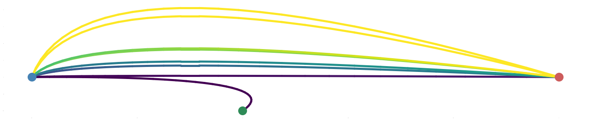
    


## Tangled chains (sequential tanglegrams)
-------
The following code imports a bunch of trees, collapses nodes, plots them end to end coloured by the trait value of the first tree and connects the same tips by lines that follow the order of tips in the first tree.


```python
segments=['PB1','PB2','PA','HA','NP','NA','M1','NS1']

trees={} ## dict
for segment in segments:
    print(segment,)
    address=r'https://raw.githubusercontent.com/evogytis/fluB/master/data/mcc%%20trees/InfB_%st_ALLs1.mcc.tre'%(segment) ## address of example tree
    
    fetch_tree = requests.get(address) ## fetch tree
    treeFile=sio(fetch_tree.text) ## stream from repo copy
    
    ll=bt.loadNexus(treeFile,tip_regex='_([0-9\-]+)$') ## treeFile here can alternatively be a path to a local file
    trees[segment]=ll.collapseBranches(lambda k:k.traits['posterior']<0.5) ## add tree object to dict
    trees[segment]=trees[segment].reduceTree([k for k in ll.Objects if k.branchType=='leaf' and k.numName in map(str,range(0,452,5))]) ## reduce tree to every 5th tip, to make plotting faster later
    
print('\nDone!')
```

    PB1
    PB2
    PA
    HA
    NP
    NA
    M1
    NS1
    
    Done!


Each neighbouring tree first needs to be iteratively untangled as much as possible.


```python
tip_positions={x:{} for x in segments} ## remember the position of each tip in each tree

for t,tr in enumerate(trees.keys()): ## iterate over trees
    cur_tree=trees[tr] ## fetch tree object
    for k in cur_tree.Objects:
        if k.branchType=='leaf':
            tip_positions[tr][k.name]=(k.height,k.y) ## remember (X, Y) position of tip

cmap=mpl.cm.Spectral

tip_positions={x:{} for x in trees} ## remember the position of each tip in each tree

for t,tr in enumerate(trees.keys()): ## iterate over trees
    cur_tree=trees[tr] ## fetch tree object
    for k in cur_tree.Objects:
        if k.branchType=='leaf':
            tip_positions[tr][k.name]=(k.height,k.y) ## remember (X, Y) position of tip

cmap=mpl.cm.Spectral

for X in range(10): ## 10 untangling iterations
    print('iteration %d'%(X+1))
    for t,tr in enumerate(segments): ## iterate over each tree
        print(tr)
        ptr=segments[t-1] ## previous tree
        ntr=segments[t] ## next tree
        seg=trees[ptr] ## fetch appropriate tree
        nex_seg=trees[ntr]
        for k in sorted(nex_seg.Objects,key=lambda q:q.height): ## iterate over branches from most recent to oldest
            if k.branchType=='node': ## can only sort nodes
                leaves=[[seg.tipMap[tip] for tip in w.leaves if tip in seg.tipMap] if w.branchType=='node' else [w.name] for w in k.children] ## descendent tips in current order
                
#                 leaves=[[seg.tipMap[tip] for tip in w.leaves] if w.branchType=='node' else [w.name] for w in k.children] ## descendent tips in current order
                
                for c in range(len(leaves)):
#                     leaves[c]=sorted(leaves[c],key=lambda x:tip_positions[ntr][x][1]) ## sort leaves according to their positions in the next tree
                    leaves[c]=sorted(leaves[c],key=lambda x:tip_positions[ntr][x][1] if x in tip_positions[ntr] else 0.0) ## sort leaves according to their positions in the next tree
                
                ys=[sorted([tip_positions[ntr][w][1] for w in cl if w in tip_positions[ntr]]) for cl in leaves] ## extract y positions of descendents
                merge_ys=sum(ys,[]) ## flatten list of tip y coordinates
                ypos=range(int(min(merge_ys)),int(max(merge_ys))+1) ## get y positions of tips in current order
                order={i:x for i,x in enumerate(leaves)} ## dict of tip order: tip name
                
                new_order=sorted(order.keys(),key=lambda x:-np.mean([(tip_positions[ptr][order[x][w]][1]-ypos[w]) for w in range(min([len(order[x]),len(ypos)])) if order[x][w] in tip_positions[ptr]])) ## get new order by sorting existing order based on y position differences
                
#                 new_order=sorted(order.keys(),key=lambda x:-np.mean([(tip_positions[ptr][order[x][w]][1]-ypos[w]) for w in range(len(order[x]))])) ## get new order by sorting existing order based on y position differences
                
                if new_order!=range(len(leaves)): ## if new order is not current order
                    k.children=[k.children[i] for i in new_order] ## assign new order of child branches
                    nex_seg.drawTree() ## update y positions

                    for w in nex_seg.Objects: ## iterate over objects in next tree
                        if w.branchType=='leaf':
                            tip_positions[ntr][w.name]=(w.height,w.y) ## remember new positions
                
        if t==0: ## if first tree
            trees[segments[t]].drawTree() ## update positions
            lvs=sorted([w for w in trees[segments[t]].Objects if w.branchType=='leaf'],key=lambda x:x.y) ## get leaves in y position order
            
            norm=mpl.colors.Normalize(0,len(lvs))
            pos_colours={w.name:cmap(norm(w.y)) for w in lvs} ## assign colour
```

    iteration 1
    PB1
    PB2
    PA
    HA
    NP
    NA
    M1
    NS1
    iteration 2
    PB1
    PB2
    PA
    HA
    NP
    NA
    M1
    NS1
    iteration 3
    PB1
    PB2
    PA
    HA
    NP
    NA
    M1
    NS1
    iteration 4
    PB1
    PB2
    PA
    HA
    NP
    NA
    M1
    NS1
    iteration 5
    PB1
    PB2
    PA
    HA
    NP
    NA
    M1
    NS1
    iteration 6
    PB1
    PB2
    PA
    HA
    NP
    NA
    M1
    NS1
    iteration 7
    PB1
    PB2
    PA
    HA
    NP
    NA
    M1
    NS1
    iteration 8
    PB1
    PB2
    PA
    HA
    NP
    NA
    M1
    NS1
    iteration 9
    PB1
    PB2
    PA
    HA
    NP
    NA
    M1
    NS1
    iteration 10
    PB1
    PB2
    PA
    HA
    NP
    NA
    M1
    NS1


```python
fig = plt.subplots(figsize=(20,10),facecolor='w')

gs = GridSpec(1, 1,hspace=0.0,wspace=0.0)
ax = plt.subplot(gs[0])

traitName='HA'
tree1=trees['PB1']
tree2=trees['PB2']

cmap=mpl.cm.cividis
x_attr=lambda k: k.height ## branch x position is determined by height
b_func=lambda k: 4 ## branch width function
s_func=lambda k: 50 ## size of circle at tips
su_func=lambda k: 100 ## size of circle that sits underneath and acts as an outline
c_func=lambda k: 'indianred' if k.traits[traitName]=='V' else 'steelblue'
ct_func=lambda k: cmap(k.y/float(tree1.ySpan)) ## call colour map with fraction that represents the y position of a tip (returns colour)
cu_func=lambda k: 'k' ## colour of circle sitting underneath the tip one is always black
z_func=lambda k: 100
zu_func=lambda k: 99
tree1.plotTree(ax,x_attr=x_attr,branchWidth=b_func,colour_function=c_func) ## plot tree
tree1.plotPoints(ax,x_attr=x_attr,size_function=s_func,colour_function=ct_func,zorder_function=z_func) ## plot tip circle
tree1.plotPoints(ax,x_attr=x_attr,size_function=su_func,colour_function=cu_func,zorder_function=zu_func) ## plot tip circle outline (another circle underneath)

skip=tree1.treeHeight*0.35 ## skip this many units between trees
x_attr=lambda k: tree1.treeHeight+skip+tree2.treeHeight-k.height ## for tree2 we'll offset x coordinates by the height of the tree and invert branches
tree2.plotTree(ax,x_attr=x_attr,branchWidth=b_func,colour_function=c_func) ## plot black tree
tree2.plotPoints(ax,x_attr=x_attr,size_function=s_func,colour_function=ct_func,zorder_function=z_func) ## plot circles at tips
tree2.plotPoints(ax,x_attr=x_attr,size_function=su_func,colour_function=cu_func,zorder_function=zu_func) ## plot circles underneath tip circles as an outline

for k in filter(lambda x: x.branchType=='leaf',tree1.Objects): ## grab leaf objects in tree1
    x=k.height ## get height
    y=k.y ## get y position
    
    matching_tip=tree2.getBranches(lambda x: x.branchType=='leaf' and x.name==k.name) ## fetch corresponding branch in tree2
    match_y=matching_tip.y
    xs=[x,tree1.treeHeight+0.15*skip,tree1.treeHeight+skip-0.15*skip,x_attr(matching_tip)] ## x coordinates for tangleline
    ys=[y,y,match_y,match_y] ## y coordinates for tangleline
    ax.plot(xs,ys,color=cmap(y/float(tree1.ySpan))) ## plot tangleline
    
[ax.spines[loc].set_visible(False) for loc in ['top','right','left','bottom']]

ax.tick_params(axis='x',size=0)
ax.tick_params(axis='y',size=0)
ax.set_xticklabels([])
ax.set_yticklabels([])

ax.set_ylim(-1,tree1.ySpan+1) ## set y limits
ax.set_xlim(-5,tree1.treeHeight+skip+tree2.treeHeight+5)

plt.show()
```


    
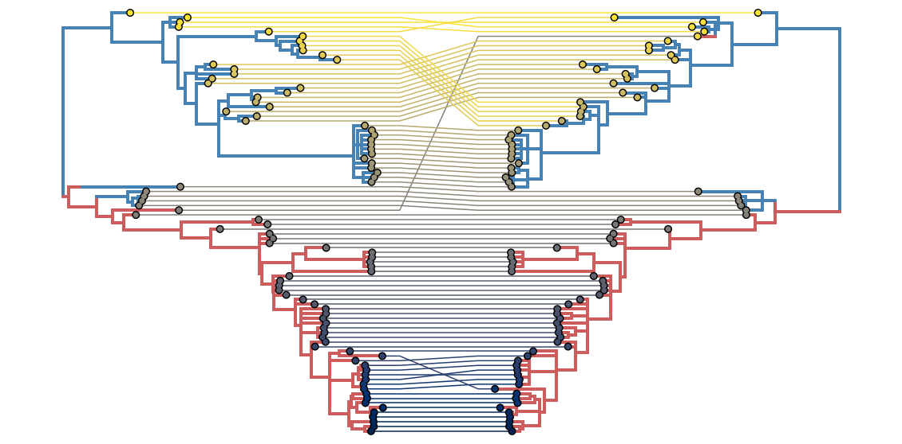
    


```python
fig,ax = plt.subplots(figsize=(40,10),facecolor='w')

traitName='PB1' ## choose a trait to colour branches by
cmap=mpl.cm.viridis
cumulative_displace=0 ## this tracks the "current" x position, so trees are plotted one after another

tree_names=['PB1','PB2','HA','PA','NP','NA','M1','NS1'] ## define order in which dict will be accessed

displaceAmount=10
for t,tr in enumerate(tree_names): ## iterate over trees
    cur_tree=trees[tr] ## fetch tree object
    x_attr=lambda k: k.height+cumulative_displace
    
    b_func=lambda k: 4
    s_func=lambda k: 30
    su_func=lambda k: 60
    ct_func=lambda k: cmap(tip_positions['PB1'][k.name][1]/float(cur_tree.ySpan))
    cu_func=lambda k: 'k'
    z_func=lambda k: 100
    zu_func=lambda k: 99
    
    def colour_func(node):
        if traitName in node.traits:
            return 'indianred' if node.traits[traitName]=='V' else 'steelblue'
        else:
            return 'k'
        
    cn_func=colour_func
    
    cur_tree.plotTree(ax,x_attr=x_attr,branchWidth=b_func,colour_function=cn_func)
    cur_tree.plotPoints(ax,x_attr=x_attr,size_function=s_func,colour_function=ct_func,zorder_function=z_func)
    cur_tree.plotPoints(ax,x_attr=x_attr,size_function=su_func,colour_function=cu_func,zorder_function=zu_func)
    
    for k in cur_tree.Objects: ## iterate over branches
        if isinstance(k,bt.leaf): ## if leaf...
            y=k.y
            pos_in_first_tree=tip_positions['PB1'][k.name][1] ## fetch y coordinate of same tip in the first tree
            frac_pos=pos_in_first_tree/float(cur_tree.ySpan) ## normalize coordinate to be within interval [0.0,1.0]

            if t!=len(tree_names)-1: ## as long as we're not at the last tree - connect tips with coloured lines
                next_x,next_y=tip_positions[tree_names[t+1]][k.name] ## fetch coordinates of same tip in next tree
                next_x+=cumulative_displace+cur_tree.treeHeight+displaceAmount ## adjust x coordinate by current displacement and future displacement
                nextIncrement=cumulative_displace+cur_tree.treeHeight
                ax.plot([x_attr(k),nextIncrement+0.05*displaceAmount,nextIncrement+0.95*displaceAmount,next_x],[y,y,next_y,next_y],lw=1,ls='-',color=cmap(frac_pos),zorder=0) ## connect current tip with same tip in the next tree
    
    cumulative_displace+=cur_tree.treeHeight+displaceAmount ## increment displacement by the height of the tree

[ax.spines[loc].set_visible(False) for loc in ['top','right','left','bottom']]

ax.tick_params(axis='x',size=0)
ax.tick_params(axis='y',size=0)
ax.set_xticklabels([])
ax.set_yticklabels([])

ax.set_ylim(-1,cur_tree.ySpan+1) ## set y limits
ax.set_xlim(-5,cumulative_displace+5)

plt.show()
```


    
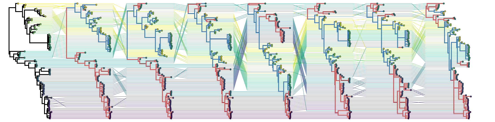
    


## Radial trees and shutter plots
-----
The cell below shows code that can be used to plot radial trees, in addition to code that could be used to plot a series of trees in a circle facing inwards with a particular isolate highlighted in all plotted phylogenies. This was a suggestion proposed by Anne-Mieke Vandamme at the amazing Virus Genomics and Evolution (#VGE16) meeting in Cambridge in June 2016.


```python
fig,ax = plt.subplots(figsize=(20,20),facecolor='w')

traitName='PB1' ## choose a trait to colour branches by

branchWidth=2 ## default branch width

# inwardSpace=-1.15 ## determines how much space is left in the middle, if negative (and >1) trees are plotted pointing outwards
inwardSpace=0.5
gap=0.95 ## determines how much of their allocated space along the circle a tree uses

tree_names=['PB1','PB2','HA','PA','NP','NA','M1','NS1'] ## define order in which dict will be accessed
# tree_names=['PB1','PB2','HA','PA','NP'] ## define order that makes a pentagram
# tree_names=['PB1','PB2','HA'] ## define order that plots coevolving segments
# tree_names=['PB1','HA'] ## define order that plots two trees

cmap=mpl.cm.tab20 ## choose a colour map
vega_colours={tree:[cmap((t*2)/20.0),cmap((t*2+1)/20.0)] for t,tree in enumerate(tree_names)}

circFrac=1/float(len(tree_names)) ## what fraction of the circle a single tree occupies
startFrom=np.pi ## start at some point along the circle

all_tips=[r.name for r in trees['PB1'].Objects if isinstance(r,bt.leaf)] ## get all tip names from a tree
randomTip=np.random.randint(0,len(all_tips)) ## pick random tip

foci=[all_tips[randomTip]] ## set it as focus - any tips listed here will be connected in a tanglegram-y way

controlDepth=max([trees[treeName].treeHeight for treeName in tree_names]) ## find the height of the highest tree

effects=[path_effects.Stroke(linewidth=4, foreground='white'),
                 path_effects.Stroke(linewidth=0.5, foreground='black')] ## black text, white outline

for t,tr in enumerate(tree_names): ## iterate over trees
    baseCircle=2*np.pi*startFrom ## tree starts here along the circle
    
    cur_tree=trees[tr] ## fetch tree

    leaves=[w.name for w in cur_tree.Objects if isinstance(w,bt.leaf)] ## fetch names of tips in the tree
    leafCount=len(leaves) ## count leaves in the tree
    mostRecent=max([bt.decimalDate(n.split('_')[-1],variable=True) for n in leaves]) ## find the most recent tip
    
    if inwardSpace<0.0:
        labelX=-abs(inwardSpace)*1.05
    else:
        labelX=inwardSpace+1.05
    labelY=baseCircle+circFrac*np.pi
    
    ax.text(np.sin(labelY)*labelX*1.1,np.cos(labelY)*labelX*1.1,'%s'%(tr),size=30,rotation=-np.rad2deg(labelY),va='center',ha='center',path_effects=effects)
    
    treeBar=np.linspace(baseCircle,baseCircle+2*gap*circFrac*np.pi,40)
    ax.plot(np.sin(treeBar)*labelX*1.05,np.cos(treeBar)*labelX*1.05,lw=2,ls='-',color='k')
    
    for k in cur_tree.Objects: ## iterate through objects in the tree
        y=k.y ## get y position of current object
        x=k.absoluteTime ## get x position of current object
        xp=k.parent.absoluteTime ## get x position of current object's parent

        if x==None: ## matplotlib won't plot Nones, like root
            x=0.0
        if xp==None:
            xp=x

        ## once a tree is circular (or radial) the x coordinate is transformed into a coordinate along a circle of a bigger or smaller diameter
        # this is done by starting from the inward space, and plotting things deeper in time outwards
        xc=inwardSpace+((mostRecent-x)/controlDepth) ## transform x coordinate
        xpc=inwardSpace+((mostRecent-xp)/controlDepth) ## transform x parent's coordinate

        ## circularisation of the tree depends on transforming y coordinates into positions along a circle
        # this is done by specifying a position that is a fraction along a circle of length 2*pi
        # such coordinates are then plotted using sin(y) and cos(y) to get x and y coordinates along a circle, respectively
        yc=baseCircle+circFrac*np.pi*2*(y/float(leafCount))*gap ## transform y coordinate
        
        if traitName in k.traits: ## if tree has PB1 trait - colour accordingly
            c=[vega_colours[tr][0] if k.traits[traitName]=='V' else vega_colours[tr][1]][0] ## pick from colour pairs
        else: ## otherwise - black
            c='k'
            
        if isinstance(k,bt.leaf): ## if leaf...
            s=20
            ax.scatter(np.sin(yc)*xc,np.cos(yc)*xc,s=s,facecolor=c,edgecolor='none',zorder=11) ## plot circle for every tip, notice that coordinates that were y coordinates are now transformed with sin and cos and previous x coordinate is used to scale the circle up
            ax.scatter(np.sin(yc)*xc,np.cos(yc)*xc,s=s*2,facecolor='k',edgecolor='none',zorder=10) ## plot black circle underneath

            if k.name in foci: ## if tip is one of the wanted tips for tanglegram
                p1=(np.sin(yc)*xc , np.cos(yc)*xc) ## get actual plot coordinates of origin tip along circle for a tanglegram connection
                
                startFrom2=startFrom ## start circle positioning based on current position
                for nex in range(t,len(tree_names)): ## iterate over other trees
                    if nex>t: ## only start at the next tree
                        nex_tree=trees[tree_names[nex]] ## fetch next tree
                        baseCircle2=2*np.pi*startFrom2
                        leaves2=[w.name for w in nex_tree.Objects if isinstance(w,bt.leaf)] ## fetch names of tips in the next tree
                        leafCount2=len(leaves2) ## count leaves in next tree
                        mostRecent2=max([bt.decimalDate(n.split('_')[-1],variable=True) for n in leaves]) ## find the most recent tip in the next tree
                        
                        for h in nex_tree.Objects: ## iterate through objects in next tree
                            if isinstance(h,bt.leaf) and h.name==k.name: ## if at the same tip...
                                y2=h.y ## get y position
                                x2=h.absoluteTime ## get x position
                                xp2=h.parent.absoluteTime ## get x position of current object's parent

                                if x2==None: ## matplotlib won't plot Nones, like root
                                    x2=0.0
                                if xp2==None:
                                    xp2=x2

                                xc2=inwardSpace+((mostRecent2-x2)/controlDepth) ## transform x coordinate of object in next tree
                                xpc2=inwardSpace+((mostRecent2-xp2)/controlDepth) ## transform x parent's coordinate in next tree
                                yc2=baseCircle2+circFrac*np.pi*2*(y2/float(leafCount2))*gap ## transform y coordinate in next tree

                                p2=(np.sin(yc2)*xc2,np.cos(yc2)*xc2) ## get actual plot coordinate of target tip in next tree
                                
                                bez_points=np.array([p1,(0.0,0.0),p2]).transpose()
                                xs,ys=bezier.Curve(bez_points,2).evaluate_multi(np.linspace(0,1,30))
                                ax.plot(xs,ys,color='k',ls='--',lw=1) ## plot Bezier curve

                    startFrom2+=circFrac ## increment to next tree
            
        elif isinstance(k,bt.node): ## if node...
            yl=k.children[-1].y ## fetch first child y coordinate
            yr=k.children[0].y ## fetch last child y coordinate

            ycl=baseCircle+circFrac*np.pi*2*(yl/float(leafCount))*gap ## transform coordinates of first child
            ycr=baseCircle+circFrac*np.pi*2*(yr/float(leafCount))*gap ## transform coordinates of last child

            ybar=np.linspace(ycl,ycr,15) ## create a curved bar

            ax.plot(np.sin(ybar)*xc,np.cos(ybar)*xc,lw=branchWidth,color=c,ls='-',zorder=9) ## plot curved bar at the base of a node

        ax.plot([np.sin(yc)*xc,np.sin(yc)*xpc],[np.cos(yc)*xc,np.cos(yc)*xpc],lw=branchWidth,color=c,ls='-',zorder=9) ## plot ancestral branch
    
    startFrom+=circFrac ## increment position along circle for next tree

# ax.set_xlim(-inwardSpace*1.1,inwardSpace*1.1) ## plot limits
# ax.set_ylim(-inwardSpace*1.1,inwardSpace*1.1)

[ax.spines[loc].set_visible(False) for loc in ['top','right','left','bottom']] ## no axes

ax.tick_params(axis='x',size=0) ## no labels
ax.tick_params(axis='y',size=0)
ax.set_xticklabels([])
ax.set_yticklabels([])

ax.set_aspect(1) ## aspect set to 1 for proper circular plot
plt.show()
```


    
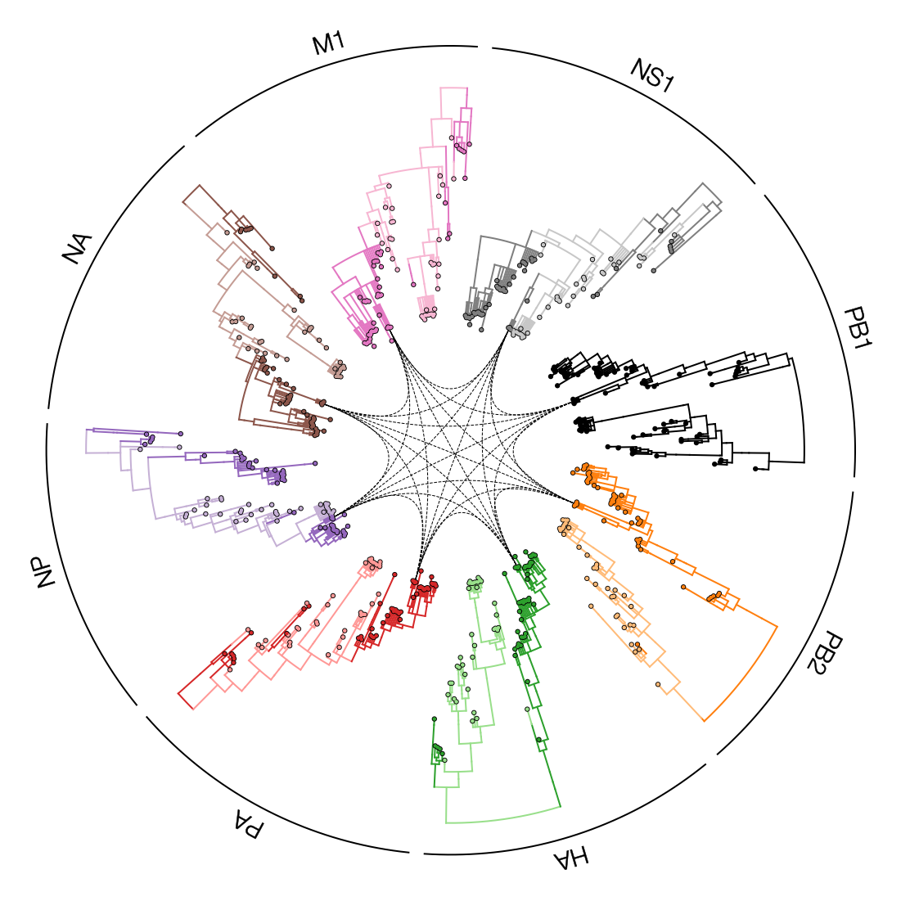
    


This cell re-orients the tree such that time now follows the circle.


```python
fig,ax = plt.subplots(figsize=(20,20),facecolor='w')

traitName='PB1' ## choose a trait to colour branches by

branchWidth=2 ## default branch width

# inwardSpace=-1.15 ## determines how much space is left in the middle, if negative (and >1) trees are plotted radiating outwards
inwardSpace=0.5
gap=0.9 ## determines how much of their allocated space along the circle a tree uses

tree_names=['PB1','PB2','HA','PA','NP','NA','M1','NS1'] ## define order in which dict will be accessed
# tree_names=['PB1','PB2','HA','PA','NP'] ## define order that makes a pentagram
# tree_names=['PB1','PB2','HA'] ## define order that plots coevolving segments
# tree_names=['PB1','HA'] ## define order that plots two trees

cmap=mpl.cm.tab20 ## choose a colour map
vega_colours={tree:[cmap((t*2)/20.0),cmap((t*2+1)/20.0)] for t,tree in enumerate(tree_names)}

totalCircle=sum([trees[treeName].treeHeight for treeName in tree_names]) ## what fraction of the circle a single tree occupies
startFrom=np.pi ## start at some point along the circle

all_tips=[r.name for r in trees['PB1'].Objects if isinstance(r,bt.leaf)] ## get all tip names from a tree
randomTip=np.random.randint(0,len(all_tips)) ## pick random tip

foci=[all_tips[randomTip]] ## set it as focus - any tips listed here will be connected in a tanglegram-y way

controlDepth=len(trees[tree_names[0]].Objects)/2 ## find the height of the highest tree along y axis

for t,tr in enumerate(tree_names): ## iterate over trees
    baseCircle=2*np.pi*startFrom ## tree starts here along the circle
    
    cur_tree=trees[tr] ## fetch tree
    circFrac=cur_tree.treeHeight/totalCircle
    leaves=[w.name for w in cur_tree.Objects if isinstance(w,bt.leaf)] ## fetch names of tips in the tree
    leafCount=len(leaves) ## count leaves in the tree
    mostRecent=max([bt.decimalDate(n.split('_')[-1],variable=True) for n in leaves]) ## find the most recent tip
    
    if inwardSpace<0.0:
        labelX=-abs(inwardSpace)*1.05
    else:
        labelX=inwardSpace+1.05
    labelY=baseCircle+circFrac*np.pi*gap
    
    ax.text(np.sin(labelY)*labelX*1.05,np.cos(labelY)*labelX*1.05,'%s'%(tr),size=30,rotation=-np.rad2deg(labelY),va='center',ha='center')
    
    treeBar=np.linspace(baseCircle,baseCircle+2*gap*circFrac*np.pi,40)
    ax.plot(np.sin(treeBar)*labelX,np.cos(treeBar)*labelX,lw=2,ls='-',color='k')
    
    for k in cur_tree.Objects: ## iterate through objects in the tree
        y=k.y ## get y position of current object
        x=k.absoluteTime ## get x position of current object
        xp=k.parent.absoluteTime ## get x position of current object's parent
        
        if x==None: ## matplotlib won't plot Nones, like root
            x=0.0
        if xp==None:
            xp=x

        ## once a tree is circular (or radial) the y coordinate is transformed into a coordinate along a circle of a bigger or smaller diameter
        # this is done by starting from the inward space, and plotting things higher or lower along the circle
        yc=inwardSpace+y/float(leafCount) ## transform y coordinate

        ## circularisation of the tree depends on transforming x coordinates into positions along a circle
        # this is done by specifying a position that is a fraction along a circle of length 2*pi
        # such coordinates are then plotted using sin(x) and cos(x) to get y and x coordinates along a circle, respectively
        xc=baseCircle+circFrac*np.pi*2*(k.height/float(cur_tree.treeHeight))*gap ## transform x coordinate
        xpc=baseCircle+circFrac*np.pi*2*(k.parent.height/float(cur_tree.treeHeight))*gap ## transform x parent's coordinate
        
        xbar=np.linspace(xpc,xc,15)

        if traitName in k.traits: ## if tree has trait - colour accordingly
            c=[vega_colours[tr][0] if k.traits[traitName]=='V' else vega_colours[tr][1]][0]
        else: ## otherwise - black
            c='k'
            
        if isinstance(k,bt.leaf): ## if leaf...
            s=20
            tc=c
            
            ax.scatter(np.sin(xc)*yc,np.cos(xc)*yc,s=s,facecolor=tc,edgecolor='none',zorder=11) ## plot circle for every tip, notice that coordinates that were x coordinates are now transformed with sin and cos and previous y coordinate is used to scale the circle up
            ax.scatter(np.sin(xc)*yc,np.cos(xc)*yc,s=2*s,facecolor='k',edgecolor='none',zorder=10) ## plot black circle underneath
            
            ## commenting out the following block to skip tanglegrams
            nex_tree=trees[tree_names[t-1]]
            for l in nex_tree.Objects:
                if isinstance(l,bt.leaf) and l.name==k.name:
                    #baseCircle2=startFrom-(nex_tree.treeHeight/totalCircle)
                    nexCircFrac=nex_tree.treeHeight/totalCircle
                    nxc=2*np.pi*(startFrom-nexCircFrac)+np.pi*2*nexCircFrac*(l.height/float(nex_tree.treeHeight))*gap ## transform y coordinate
                    nyc=inwardSpace+l.y/float(leafCount)
                    
                    ax.plot([np.sin(xc)*yc,np.sin(nxc)*nyc],[np.cos(xc)*yc,np.cos(nxc)*nyc],color=tc,ls='--',zorder=8)
            
        elif isinstance(k,bt.node): ## if node...
            yl=k.children[-1].y ## fetch first child y coordinate
            yr=k.children[0].y ## fetch last child y coordinate

            ycl=inwardSpace+yl/float(leafCount)
            ycr=inwardSpace+yr/float(leafCount)
            
            ax.plot([np.sin(xc)*ycl,np.sin(xc)*ycr],[np.cos(xc)*ycl,np.cos(xc)*ycr],lw=branchWidth,color='k',ls='-',zorder=9)

        ax.plot(np.sin(xbar)*yc,np.cos(xbar)*yc,lw=branchWidth,color='k',ls='-',zorder=9) ## plot ancestral branch
    
    startFrom+=circFrac ## increment position along circle for next tree

# ax.set_xlim(-inwardSpace*1.1,inwardSpace*1.1) ## plot limits
# ax.set_ylim(-inwardSpace*1.1,inwardSpace*1.1)

[ax.spines[loc].set_visible(False) for loc in ['top','right','left','bottom']] ## no axes

ax.tick_params(axis='x',size=0) ## no labels
ax.tick_params(axis='y',size=0)
ax.set_xticklabels([])
ax.set_yticklabels([])

ax.set_aspect(1) ## aspect set to 1 for proper circular plot
plt.show()
```


    
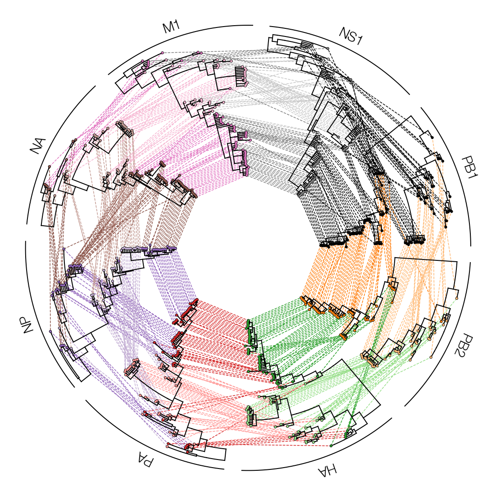
    


## Multitype trees

baltic now has the ability to deal with multitype trees recovered as part of structured coalescent analyses, which contain nodes with a single child. You can find an example of the files you might find after running a structured coalescent analysis in beast2 [here](https://github.com/Taming-the-BEAST/Structured-coalescent/).


```python
address='https://raw.githubusercontent.com/Taming-the-BEAST/Structured-coalescent/master/precooked_runs/MTT.h3n2_2deme.map.trees' ## address of example tree
fetch_tree = requests.get(address) ## fetch tree
treeFile=sio(fetch_tree.text) ## stream from repo copy

mtt=bt.loadNexus(treeFile,absoluteTime=False) ## treeFile here can alternatively be a path to a local file
mtt.treeStats() ## report stats about tree
mtt.sortBranches()

fig,ax = plt.subplots(figsize=(10,10),facecolor='w')

c_func=lambda k: 'indianred' if k.traits['type']=='HongKong' else 'steelblue'
s_func=lambda k: 30
z_func=lambda k: 100

n_target=lambda k: k.branchType=='node' and len(k.children)==1
sn_func=lambda k: 50
zn_func=lambda k: 101

cu_func=lambda k: 'k'
su_func=lambda k: 60
zu_func=lambda k: 99

mtt.plotTree(ax,colour_function=c_func)

kwargs={'marker':'|','lw':2}
mtt.plotPoints(ax,target=n_target,size_function=sn_func,colour_function=c_func,zorder_function=zn_func,**kwargs)

mtt.plotPoints(ax,size_function=s_func,colour_function=c_func,zorder_function=z_func)
mtt.plotPoints(ax,size_function=su_func,colour_function=cu_func,zorder_function=zu_func)

ax.set_ylim(-1,mtt.ySpan+1)

[ax.spines[loc].set_visible(False) for loc in ['top','right','left','bottom']] ## no axes

ax.tick_params(axis='x',size=0) ## no labels
ax.tick_params(axis='y',size=0)
ax.set_xticklabels([])
ax.set_yticklabels([])

plt.show()
```

    
    Tree height: 6.636090
    Tree length: 35.270573
    multitype tree
    annotations present
    
    Numbers of objects in tree: 129 (69 nodes and 60 leaves)
    


    
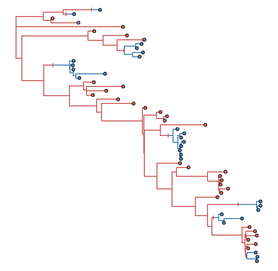
    


## Collapsing clades

baltic allows subtrees to be collapsed. When given a node object the collapseSubtree function will replace that node and any of its descendants with a clade object. These pose as tips, but contain attributes that allow the clade object to be plotted in a way that can represent how many tips were present in the collapsed clade or when the most recent tip of the collapsed subtree existed.


```python
fig,ax = plt.subplots(figsize=(10,10),facecolor='w')

branchWidth=2 ## default branch width

ancestor=mtt.commonAncestor(mtt.getExternal(lambda k: k.numName in ['37','46'])) ## identify common ancestor node of two (or more) tips

mtt.collapseSubtree(ancestor,'Collapsed node',widthFunction=lambda x:1) ## the width function transforms the number of descendant tips that the node had into an amount of vertical space that the clade will receive in the plotted tree
mtt.sortBranches()

effects=[path_effects.Stroke(linewidth=4, foreground='white'),
                 path_effects.Stroke(linewidth=0.5, foreground='black')] ## black text, white outline

c_func=lambda k: 'indianred' if k.traits['type']=='HongKong' else 'steelblue'
s_func=lambda k: 30
z_func=lambda k: 100

n_target=lambda k: k.branchType=='node' and len(k.children)==1
sn_func=lambda k: 50
zn_func=lambda k: 101

cu_func=lambda k: 'k'
su_func=lambda k: 60
zu_func=lambda k: 99

mtt.plotTree(ax,colour_function=c_func)

kwargs={'marker':'|','lw':2}
mtt.plotPoints(ax,target=n_target,size_function=sn_func,colour_function=c_func,zorder_function=zn_func,**kwargs)

mtt.plotPoints(ax,size_function=s_func,colour_function=c_func,zorder_function=z_func)
mtt.plotPoints(ax,size_function=su_func,colour_function=cu_func,zorder_function=zu_func)

pos_func=lambda k: (k.x+30/365.0,k.y)
text_func=lambda k: k.numName
kwargs={'ha':'left','va':'center','size':12,'path_effects':effects}
mtt.addText(ax,position=pos_func,text=text_func,**kwargs)

ax.set_ylim(-1,mtt.ySpan+1)

[ax.spines[loc].set_visible(False) for loc in ['top','right','left','bottom']] ## no axes

ax.tick_params(axis='x',size=0) ## no labels
ax.tick_params(axis='y',size=0)
ax.set_xticklabels([])
ax.set_yticklabels([])

plt.show()
```


    
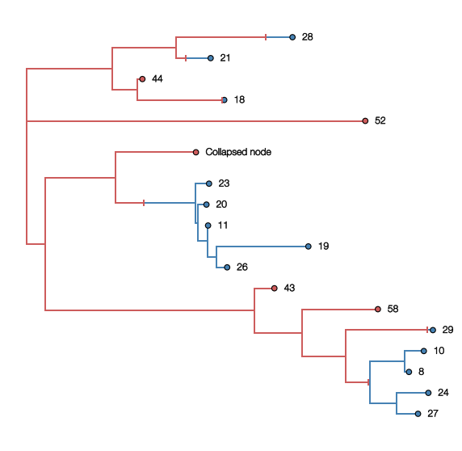
    


```python
mtt.uncollapseSubtree() ## reset tree by uncollapsing clades

ancestor=mtt.commonAncestor(mtt.getExternal(lambda k: k.numName in ['23','26'])) ## identify common ancestor node of two (or more) tips
mtt.collapseSubtree(ancestor,'Collapsed node',widthFunction=lambda x:len(x.leaves)/2)
ancestor=mtt.commonAncestor(mtt.getExternal(lambda k: k.numName in ['22','25'])) ## identify common ancestor node of two (or more) tips
mtt.collapseSubtree(ancestor,'Collapsed node2',widthFunction=lambda x:len(x.leaves)/2)
ancestor=mtt.commonAncestor(mtt.getExternal(lambda k: k.numName in ['30','16'])) ## identify common ancestor node of two (or more) tips
mtt.collapseSubtree(ancestor,'Collapsed node3',widthFunction=lambda x:len(x.leaves)/2)
ancestor=mtt.commonAncestor(mtt.getExternal(lambda k: k.numName in ['34','14'])) ## identify common ancestor node of two (or more) tips
mtt.collapseSubtree(ancestor,'Collapsed node4',widthFunction=lambda x:len(x.leaves)/2)
ancestor=mtt.commonAncestor(mtt.getExternal(lambda k: k.numName in ['43','27'])) ## identify common ancestor node of two (or more) tips
mtt.collapseSubtree(ancestor,'Collapsed node5',widthFunction=lambda x:len(x.leaves)/2)

mtt.traverse_tree()
mtt.sortBranches()

print(mtt.treeHeight)

fig,ax = plt.subplots(figsize=(10,10),facecolor='w')

effects=[path_effects.Stroke(linewidth=4, foreground='white'),
                 path_effects.Stroke(linewidth=0.5, foreground='black')] ## black text, white outline

t_target=lambda k: isinstance(k,bt.leaf)
c_func=lambda k: 'indianred' if k.traits['type']=='HongKong' else 'steelblue'
s_func=lambda k: 30
z_func=lambda k: 100

n_target=lambda k: k.branchType=='node' and len(k.children)==1
sn_func=lambda k: 50
zn_func=lambda k: 101

cu_func=lambda k: 'k'
su_func=lambda k: 60
zu_func=lambda k: 99

mtt.plotTree(ax,colour_function=c_func)

kwargs={'marker':'|','lw':2}
mtt.plotPoints(ax,target=n_target,size_function=sn_func,colour_function=c_func,zorder_function=zn_func,**kwargs)

mtt.plotPoints(ax,target=t_target,size_function=s_func,colour_function=c_func,zorder_function=z_func)
mtt.plotPoints(ax,target=t_target,size_function=su_func,colour_function=cu_func,zorder_function=zu_func)

c_target=lambda k: isinstance(k,bt.clade)
pos_func=lambda k: (k.lastHeight+30/365.0,k.y)
text_func=lambda k: k.numName
kwargs={'ha':'left','va':'center','size':12,'path_effects':effects}
mtt.addText(ax,target=c_target,position=pos_func,text=text_func,**kwargs)

for k in mtt.Objects: ## iterate over objects in tree
    if isinstance(k,bt.clade): ## if not - it's actually a clade object
        x=k.x
        y=k.y
        c='indianred' if k.traits['type']=='HongKong' else 'steelblue'
        clade=plt.Polygon(([x,y-0.001*len(mtt.Objects)],[x,y+0.001*len(mtt.Objects)],[k.lastHeight,y+k.width/2.0],[k.lastHeight,y-k.width/2.0]),facecolor=c,edgecolor='none',zorder=12) ## define a triangle polygon
        ax.add_patch(clade)

[ax.spines[loc].set_visible(False) for loc in ['top','right','left','bottom']] ## no axes

ax.tick_params(axis='x',size=0) ## no labels
ax.tick_params(axis='y',size=0)
ax.set_xticklabels([])
ax.set_yticklabels([])
    
ax.set_ylim(-1,mtt.ySpan+5)
plt.show()
```

    6.5264091678620755


    
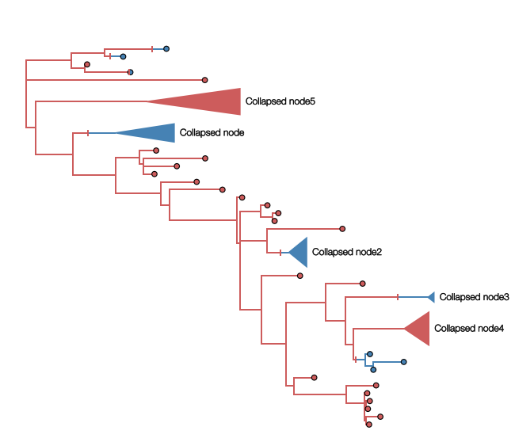
    


Unrooted trees can now be drawn too.


```python
mtt.uncollapseSubtree() ## uncollapse
mtt.drawUnrooted() ## draw tree as unrooted

fig,ax = plt.subplots(figsize=(10,10),facecolor='w')

c_func=lambda k: mpl.cm.Reds(k.height/mtt.treeHeight) if k.traits['type']=='HongKong' else mpl.cm.Blues(k.height/mtt.treeHeight)
s_func=lambda k: 30
z_func=lambda k: 100

x_attr=lambda k: k.x
cu_func=lambda k: 'k'
su_func=lambda k: 60
zu_func=lambda k: 99

mtt.plotTree(ax,type='unrooted',x_attr=x_attr,colour_function=c_func)
mtt.plotPoints(ax,x_attr=x_attr,size_function=s_func,colour_function=c_func,zorder_function=z_func)
mtt.plotPoints(ax,x_attr=x_attr,size_function=su_func,colour_function=cu_func,zorder_function=zu_func)

[ax.spines[loc].set_visible(False) for loc in ['top','right','left','bottom']] ## no axes

ax.tick_params(axis='x',size=0) ## no labels
ax.tick_params(axis='y',size=0)
ax.set_xticklabels([])
ax.set_yticklabels([])

plt.show()
```


    
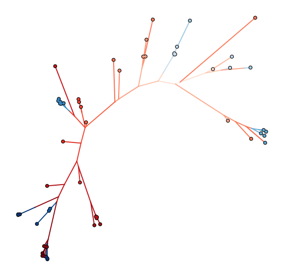
    


## Clade frequencies
-----------------
Richard Neher (at University of Basel) has written a script to calculate clade frequencies (smoothed nested frequency trajectories of tips) over time which is part of [nextstrain's](https://nextstrain.org/) [`augur` module](https://github.com/nextstrain/augur). The next few cells show how clade frequencies can be incorporated into baltic via Biopython's phylogenetics parts and plotted.


```python
import sys
from augur import frequencies,frequency_estimators

address='https://raw.githubusercontent.com/evogytis/fluB/master/data/mcc%20trees/InfB_NPt_ALLs1.mcc.tre' ## address of example tree

fetch_tree = requests.get(address) ## fetch tree
treeFile=sio(fetch_tree.text) ## stream from repo copy

ll=bt.loadNexus(treeFile,tip_regex='_([0-9\-]+)$') ## treeFile here can alternatively be a path to a local file

tips=[k.name for k in ll.Objects if k.branchType=='leaf'] ## get tip names
tipDates=[k.split('_')[-1] for k in tips] ## isolate collection date from tip name
dates=[bt.decimalDate(k,variable=True) for k in tipDates] ## convert dates into decimal dates

try:
    tr = Phylo.read(csio(ll.toString()), "newick") ## create a Bio.Phylo tree from the baltic tree
except:
    tr = Phylo.read(sio(ll.toString()), "newick")
    
for k in ll.Objects:
    if k.length<0.0:
        k.length=0.0 ## convert negative branch lengths to 0.0

for n,nd in enumerate(tr.get_terminals()):
    if hasattr(nd,'attr')==False:
        setattr(nd,'attr',{})
    nd.attr['num_date'] = bt.decimalDate(nd.name.split('_')[-1],variable=True) ## assign collection date to Bio.Phylo tips

pivots = np.array(frequency_estimators.make_pivots(200,np.array(dates))) ## create time grid for clade frequencies
bfq=frequencies.tree_frequencies(tr,min_clades=10,node_filter=None,pivots=pivots,verbose=True) ## create a frequencies object
print('Done!')
```

    Done!


```python
bfq.estimate_clade_frequencies() ## estimate smoothed trajectories
```

    Estimating frequencies of children of node  0
    Estimating frequencies of children of node  1
    Estimating frequencies of children of node  2
    Estimating frequencies of children of node  4
    Estimating frequencies of children of node  6
    Estimating frequencies of children of node  8
    Estimating frequencies of children of node  10
    Estimating frequencies of children of node  13
    Estimating frequencies of children of node  14
    Estimating frequencies of children of node  17
    Estimating frequencies of children of node  19
    Estimating frequencies of children of node  21
    Estimating frequencies of children of node  24
    Estimating frequencies of children of node  26
    Estimating frequencies of children of node  27
    Estimating frequencies of children of node  30
    Estimating frequencies of children of node  31
    Estimating frequencies of children of node  33
    Estimating frequencies of children of node  35
    Estimating frequencies of children of node  37
    Estimating frequencies of children of node  39
    Estimating frequencies of children of node  42
    Estimating frequencies of children of node  43
    Estimating frequencies of children of node  45
    Estimating frequencies of children of node  48
    Estimating frequencies of children of node  50
    Estimating frequencies of children of node  51
    Estimating frequencies of children of node  53
    Estimating frequencies of children of node  56
    Estimating frequencies of children of node  57
    Estimating frequencies of children of node  60
    Estimating frequencies of children of node  62
    Estimating frequencies of children of node  63
    Estimating frequencies of children of node  64
    Estimating frequencies of children of node  66
    Estimating frequencies of children of node  68
    Estimating frequencies of children of node  70
    Estimating frequencies of children of node  71
    Estimating frequencies of children of node  73
    Estimating frequencies of children of node  76
    Estimating frequencies of children of node  78
    Estimating frequencies of children of node  80
    Estimating frequencies of children of node  82
    Estimating frequencies of children of node  85
    Estimating frequencies of children of node  87
    Estimating frequencies of children of node  88
    Estimating frequencies of children of node  90
    Estimating frequencies of children of node  92
    Estimating frequencies of children of node  95
    Estimating frequencies of children of node  97
    Estimating frequencies of children of node  99
    Estimating frequencies of children of node  101
    Estimating frequencies of children of node  103
    Estimating frequencies of children of node  104
    Estimating frequencies of children of node  106
    Estimating frequencies of children of node  109
    Estimating frequencies of children of node  110
    Estimating frequencies of children of node  111
    Estimating frequencies of children of node  114
    Estimating frequencies of children of node  116
    Estimating frequencies of children of node  117
    Estimating frequencies of children of node  120
    Estimating frequencies of children of node  122
    Estimating frequencies of children of node  125
    Estimating frequencies of children of node  126
    Estimating frequencies of children of node  129
    Estimating frequencies of children of node  130
    Estimating frequencies of children of node  131
    Estimating frequencies of children of node  134
    Estimating frequencies of children of node  136
    Estimating frequencies of children of node  138
    Estimating frequencies of children of node  140
    Estimating frequencies of children of node  141
    Estimating frequencies of children of node  143
    Estimating frequencies of children of node  145
    Estimating frequencies of children of node  148
    Estimating frequencies of children of node  150
    Estimating frequencies of children of node  152
    Estimating frequencies of children of node  154
    Estimating frequencies of children of node  157
    Estimating frequencies of children of node  159
    Estimating frequencies of children of node  161
    Estimating frequencies of children of node  162
    Estimating frequencies of children of node  165
    Estimating frequencies of children of node  166
    Estimating frequencies of children of node  169
    Estimating frequencies of children of node  170
    Estimating frequencies of children of node  171
    Estimating frequencies of children of node  174
    Estimating frequencies of children of node  175
    Estimating frequencies of children of node  177
    Estimating frequencies of children of node  180
    Estimating frequencies of children of node  181
    Estimating frequencies of children of node  183
    Estimating frequencies of children of node  185
    Estimating frequencies of children of node  187
    Estimating frequencies of children of node  190
    Estimating frequencies of children of node  191
    Estimating frequencies of children of node  193
    Estimating frequencies of children of node  195
    Estimating frequencies of children of node  198
    Estimating frequencies of children of node  200
    Estimating frequencies of children of node  202
    Estimating frequencies of children of node  204
    Estimating frequencies of children of node  207
    Estimating frequencies of children of node  209
    Estimating frequencies of children of node  210
    Estimating frequencies of children of node  213
    Estimating frequencies of children of node  215
    Estimating frequencies of children of node  217
    Estimating frequencies of children of node  219
    Estimating frequencies of children of node  220
    Estimating frequencies of children of node  222
    Estimating frequencies of children of node  225
    Estimating frequencies of children of node  226
    Estimating frequencies of children of node  227
    Estimating frequencies of children of node  229
    Estimating frequencies of children of node  231
    Estimating frequencies of children of node  234
    Estimating frequencies of children of node  236
    Estimating frequencies of children of node  237
    Estimating frequencies of children of node  239
    Estimating frequencies of children of node  242
    Estimating frequencies of children of node  243
    Estimating frequencies of children of node  245
    Estimating frequencies of children of node  248
    Estimating frequencies of children of node  250
    Estimating frequencies of children of node  253
    Estimating frequencies of children of node  255
    Estimating frequencies of children of node  256
    Estimating frequencies of children of node  257
    Estimating frequencies of children of node  259
    Estimating frequencies of children of node  262
    Estimating frequencies of children of node  263
    Estimating frequencies of children of node  266
    Estimating frequencies of children of node  268
    Estimating frequencies of children of node  270
    Estimating frequencies of children of node  273
    Estimating frequencies of children of node  274
    Estimating frequencies of children of node  275
    Estimating frequencies of children of node  278
    Estimating frequencies of children of node  281
    Estimating frequencies of children of node  282
    Estimating frequencies of children of node  284
    Estimating frequencies of children of node  287
    Estimating frequencies of children of node  289
    Estimating frequencies of children of node  291
    Estimating frequencies of children of node  293
    Estimating frequencies of children of node  296
    Estimating frequencies of children of node  297
    Estimating frequencies of children of node  299
    Estimating frequencies of children of node  301
    Estimating frequencies of children of node  304
    Estimating frequencies of children of node  306
    Estimating frequencies of children of node  307
    Estimating frequencies of children of node  310
    Estimating frequencies of children of node  311
    too few valid time points: 2
    Estimating frequencies of children of node  313
    Estimating frequencies of children of node  314
    Estimating frequencies of children of node  316
    Estimating frequencies of children of node  319
    Estimating frequencies of children of node  320
    Estimating frequencies of children of node  323
    Estimating frequencies of children of node  324
    Estimating frequencies of children of node  325
    Estimating frequencies of children of node  326
    Estimating frequencies of children of node  329
    Estimating frequencies of children of node  332
    Estimating frequencies of children of node  334
    Estimating frequencies of children of node  336
    Estimating frequencies of children of node  339
    Estimating frequencies of children of node  340
    Estimating frequencies of children of node  342
    Estimating frequencies of children of node  344
    Estimating frequencies of children of node  347
    Estimating frequencies of children of node  349
    Estimating frequencies of children of node  350
    Estimating frequencies of children of node  353
    Estimating frequencies of children of node  356
    Estimating frequencies of children of node  357
    Estimating frequencies of children of node  360
    Estimating frequencies of children of node  362
    Estimating frequencies of children of node  364
    Estimating frequencies of children of node  366
    Estimating frequencies of children of node  367
    Estimating frequencies of children of node  369
    Estimating frequencies of children of node  372
    Estimating frequencies of children of node  374
    Estimating frequencies of children of node  375
    Estimating frequencies of children of node  377
    Estimating frequencies of children of node  380
    Estimating frequencies of children of node  382
    Estimating frequencies of children of node  384
    Estimating frequencies of children of node  386
    Estimating frequencies of children of node  387
    Estimating frequencies of children of node  389
    Estimating frequencies of children of node  392
    Estimating frequencies of children of node  393
    Estimating frequencies of children of node  394
    Estimating frequencies of children of node  396
    Estimating frequencies of children of node  398
    Estimating frequencies of children of node  401
    Estimating frequencies of children of node  403
    Estimating frequencies of children of node  405
    Estimating frequencies of children of node  408
    Estimating frequencies of children of node  409
    Estimating frequencies of children of node  411
    Estimating frequencies of children of node  412
    Estimating frequencies of children of node  414
    Estimating frequencies of children of node  416
    Estimating frequencies of children of node  418
    Estimating frequencies of children of node  421
    Estimating frequencies of children of node  422
    Estimating frequencies of children of node  424
    Estimating frequencies of children of node  427
    Estimating frequencies of children of node  429
    Estimating frequencies of children of node  431
    Estimating frequencies of children of node  432
    Estimating frequencies of children of node  435
    Estimating frequencies of children of node  436
    Estimating frequencies of children of node  439
    Estimating frequencies of children of node  441
    Estimating frequencies of children of node  443
    Estimating frequencies of children of node  446
    Estimating frequencies of children of node  448
    Estimating frequencies of children of node  450
    Estimating frequencies of children of node  451
    Estimating frequencies of children of node  453
    Estimating frequencies of children of node  455
    Estimating frequencies of children of node  457
    Estimating frequencies of children of node  459
    Estimating frequencies of children of node  460
    Estimating frequencies of children of node  462
    Estimating frequencies of children of node  464
    Estimating frequencies of children of node  467
    Estimating frequencies of children of node  468
    Estimating frequencies of children of node  471
    Estimating frequencies of children of node  473
    Estimating frequencies of children of node  475
    Estimating frequencies of children of node  477
    Estimating frequencies of children of node  480
    Estimating frequencies of children of node  482
    Estimating frequencies of children of node  483
    Estimating frequencies of children of node  484
    Estimating frequencies of children of node  486
    Estimating frequencies of children of node  488
    Estimating frequencies of children of node  490
    Estimating frequencies of children of node  492
    Estimating frequencies of children of node  493
    Estimating frequencies of children of node  496
    Estimating frequencies of children of node  498
    Estimating frequencies of children of node  500
    Estimating frequencies of children of node  502
    Estimating frequencies of children of node  505
    Estimating frequencies of children of node  506
    Estimating frequencies of children of node  508
    Estimating frequencies of children of node  510
    Estimating frequencies of children of node  511
    Estimating frequencies of children of node  514
    Estimating frequencies of children of node  516
    Estimating frequencies of children of node  519
    Estimating frequencies of children of node  520
    Estimating frequencies of children of node  523
    Estimating frequencies of children of node  524
    Estimating frequencies of children of node  527
    Estimating frequencies of children of node  528
    Estimating frequencies of children of node  531
    Estimating frequencies of children of node  532
    Estimating frequencies of children of node  535
    too few valid time points: 2
    Estimating frequencies of children of node  537
    Estimating frequencies of children of node  538
    Estimating frequencies of children of node  539
    Estimating frequencies of children of node  541
    Estimating frequencies of children of node  544
    Estimating frequencies of children of node  546
    Estimating frequencies of children of node  549
    Estimating frequencies of children of node  551
    Estimating frequencies of children of node  552
    Estimating frequencies of children of node  553
    Estimating frequencies of children of node  556
    Estimating frequencies of children of node  559
    Estimating frequencies of children of node  561
    Estimating frequencies of children of node  563
    Estimating frequencies of children of node  565
    Estimating frequencies of children of node  566
    Estimating frequencies of children of node  569
    Estimating frequencies of children of node  572
    Estimating frequencies of children of node  574
    Estimating frequencies of children of node  575
    Estimating frequencies of children of node  578
    Estimating frequencies of children of node  579
    Estimating frequencies of children of node  581
    Estimating frequencies of children of node  584
    Estimating frequencies of children of node  586
    Estimating frequencies of children of node  588
    Estimating frequencies of children of node  589
    Estimating frequencies of children of node  590
    Estimating frequencies of children of node  593
    Estimating frequencies of children of node  595
    Estimating frequencies of children of node  596
    Estimating frequencies of children of node  598
    Estimating frequencies of children of node  601
    Estimating frequencies of children of node  602
    Estimating frequencies of children of node  604
    Estimating frequencies of children of node  607
    Estimating frequencies of children of node  608
    Estimating frequencies of children of node  611
    Estimating frequencies of children of node  612
    Estimating frequencies of children of node  613
    Estimating frequencies of children of node  615
    Estimating frequencies of children of node  618
    Estimating frequencies of children of node  619
    Estimating frequencies of children of node  621
    Estimating frequencies of children of node  624
    Estimating frequencies of children of node  626
    Estimating frequencies of children of node  629
    Estimating frequencies of children of node  631
    Estimating frequencies of children of node  632
    Estimating frequencies of children of node  633
    Estimating frequencies of children of node  636
    Estimating frequencies of children of node  638
    Estimating frequencies of children of node  639
    Estimating frequencies of children of node  641
    Estimating frequencies of children of node  643
    Estimating frequencies of children of node  646
    Estimating frequencies of children of node  648
    Estimating frequencies of children of node  650
    Estimating frequencies of children of node  652
    Estimating frequencies of children of node  655
    Estimating frequencies of children of node  656
    Estimating frequencies of children of node  658
    Estimating frequencies of children of node  659
    Estimating frequencies of children of node  662
    Estimating frequencies of children of node  664
    Estimating frequencies of children of node  667
    Estimating frequencies of children of node  668
    Estimating frequencies of children of node  670
    Estimating frequencies of children of node  673
    Estimating frequencies of children of node  674
    Estimating frequencies of children of node  676
    Estimating frequencies of children of node  679
    Estimating frequencies of children of node  680
    Estimating frequencies of children of node  683
    Estimating frequencies of children of node  686
    Estimating frequencies of children of node  687
    Estimating frequencies of children of node  688
    Estimating frequencies of children of node  690
    Estimating frequencies of children of node  691
    Estimating frequencies of children of node  694
    Estimating frequencies of children of node  696
    Estimating frequencies of children of node  697
    Estimating frequencies of children of node  700
    Estimating frequencies of children of node  702
    Estimating frequencies of children of node  704
    Estimating frequencies of children of node  707
    Estimating frequencies of children of node  709
    too few valid time points: 1
    Estimating frequencies of children of node  711
    too few valid time points: 1
    Estimating frequencies of children of node  713
    Estimating frequencies of children of node  714
    Estimating frequencies of children of node  715
    Estimating frequencies of children of node  718
    Estimating frequencies of children of node  719
    Estimating frequencies of children of node  722
    Estimating frequencies of children of node  723
    Estimating frequencies of children of node  726
    Estimating frequencies of children of node  728
    Estimating frequencies of children of node  731
    Estimating frequencies of children of node  732
    Estimating frequencies of children of node  733
    Estimating frequencies of children of node  736
    Estimating frequencies of children of node  739
    Estimating frequencies of children of node  740
    Estimating frequencies of children of node  743
    Estimating frequencies of children of node  745
    Estimating frequencies of children of node  747
    Estimating frequencies of children of node  750
    Estimating frequencies of children of node  751
    Estimating frequencies of children of node  753
    Estimating frequencies of children of node  754
    Estimating frequencies of children of node  756
    Estimating frequencies of children of node  759
    Estimating frequencies of children of node  761
    Estimating frequencies of children of node  762
    Estimating frequencies of children of node  764
    Estimating frequencies of children of node  765
    Estimating frequencies of children of node  768
    Estimating frequencies of children of node  770
    Estimating frequencies of children of node  771
    Estimating frequencies of children of node  774
    Estimating frequencies of children of node  776
    Estimating frequencies of children of node  779
    Estimating frequencies of children of node  780
    Estimating frequencies of children of node  781
    Estimating frequencies of children of node  784
    Estimating frequencies of children of node  787
    Estimating frequencies of children of node  788
    Estimating frequencies of children of node  791
    Estimating frequencies of children of node  793
    Estimating frequencies of children of node  794
    Estimating frequencies of children of node  797
    Estimating frequencies of children of node  800
    Estimating frequencies of children of node  801
    Estimating frequencies of children of node  804
    Estimating frequencies of children of node  805
    Estimating frequencies of children of node  806
    Estimating frequencies of children of node  808
    Estimating frequencies of children of node  810
    Estimating frequencies of children of node  811
    Estimating frequencies of children of node  814
    Estimating frequencies of children of node  816
    Estimating frequencies of children of node  818
    Estimating frequencies of children of node  821
    Estimating frequencies of children of node  822
    Estimating frequencies of children of node  825
    Estimating frequencies of children of node  826
    Estimating frequencies of children of node  828
    Estimating frequencies of children of node  831
    Estimating frequencies of children of node  833
    Estimating frequencies of children of node  835
    Estimating frequencies of children of node  837
    Estimating frequencies of children of node  840
    Estimating frequencies of children of node  842
    Estimating frequencies of children of node  844
    Estimating frequencies of children of node  845
    Estimating frequencies of children of node  847
    Estimating frequencies of children of node  848
    Estimating frequencies of children of node  851
    Estimating frequencies of children of node  853
    Estimating frequencies of children of node  856
    Estimating frequencies of children of node  857
    Estimating frequencies of children of node  858
    Estimating frequencies of children of node  861
    Estimating frequencies of children of node  863
    Estimating frequencies of children of node  865
    Estimating frequencies of children of node  867
    Estimating frequencies of children of node  870
    Estimating frequencies of children of node  871
    Estimating frequencies of children of node  874
    Estimating frequencies of children of node  875
    Estimating frequencies of children of node  877
    Estimating frequencies of children of node  880
    Estimating frequencies of children of node  881
    Estimating frequencies of children of node  882
    Estimating frequencies of children of node  885
    Estimating frequencies of children of node  886
    Estimating frequencies of children of node  889
    Estimating frequencies of children of node  892
    Estimating frequencies of children of node  893
    Estimating frequencies of children of node  896
    Estimating frequencies of children of node  898
    Estimating frequencies of children of node  900


```python
for n,nd in enumerate(ll.traverse_tree(include_condition=lambda k:True)): ## frequencies are estimated in traversal order
    if nd.branchType=='node':
        nd.traits['cf']=bfq.frequencies[n] ## assign frequency vector to node
```


```python
fig = plt.subplots(figsize=(20,20),facecolor='w')

gs = GridSpec(2, 2,height_ratios=[6,1],width_ratios=[6,1],hspace=0.0,wspace=0.0)
ax_tree = plt.subplot(gs[0])
ax_muller = plt.subplot(gs[2],sharex=ax_tree)
ax_genome = plt.subplot(gs[1],sharey=ax_tree)

condition=lambda x:x.branchType=='node' and ((len([1 for k in x.children if k.branchType=='node' and len(k.leaves)>=15])==2) or (traitName in x.parent.traits and x.traits[traitName]!=x.parent.traits[traitName]) or x==ll.root)

ll.sortBranches(descending=False)
traitName='PB2'
def plot_subclade(ax, cfreq, clade, pivots):
    """ Iteratively plot clade frequencies.
        Code written by Richard Neher.
    """
    
    if traitName in clade.traits:
        if clade.traits[traitName]=='V':
            cmap=mpl.cm.Reds
        else:
            cmap=mpl.cm.Blues
    else:
        cmap=mpl.cm.Purples_r
    
    if clade.branchType=='node':
        if condition(clade):
            fr=clade.height/ll.treeHeight
            colour=cmap(fr)
            ec='none'
            cfs=clade.traits['cf']
            inc=cfs
            idx0,idx1=None,None

            idx_cfs=np.where((cfreq+inc)>0.0) ## identify indices where frequencies are >0.0
            idx_pvt=np.where(clade.absoluteTime<pivots) ## identify indices where pivots are greater than date of node 
            idx0=max([min(idx[0]) for idx in [idx_cfs,idx_pvt] if len(idx[0])>0]) ## pick the one that's higher
            earliest=min([bt.decimalDate(ll.tipMap[k].split('_')[-1],variable=True) for k in clade.leaves])
            idx_lf=np.where(earliest<pivots) ## identify indices where pivots are greater than date of node 
            idx1=idx_lf[0][0]
            
            i=clade.traits['cf']
            p=pivots
            c=cfreq
            
            I=i[idx0:]
            P=p[idx0:]
            C=c[idx0:]
            
            ax.fill_between(p[idx1:],c[idx1:],c[idx1:]+inc[idx1:],
                        facecolor=colour,
                        edgecolor=ec,alpha=1.0,
                        linestyle='-',zorder=sorted([k.height for k in ll.Objects]).index(clade.height))
            
            ax.plot(p[idx1:],c[idx1:],ls='-',color='k',lw=2,zorder=int(clade.height*100001))
            ax.plot(p[idx1:],c[idx1:]+inc[idx1:],ls='-',color='k',lw=2,zorder=int(clade.height*100001))
            
            ax.plot(p[idx0:idx1],c[idx0:idx1],ls='--',color='k',lw=1,zorder=int(clade.height*100001))
            ax.plot(p[idx0:idx1],c[idx0:idx1]+inc[idx0:idx1],ls='--',color='k',lw=1,zorder=int(clade.height*100001))
            
    tmp_cfreq = np.copy(cfreq)
    
    for child in clade.children:
        if child.branchType=='node':
            tmp_cfreq = plot_subclade(ax, tmp_cfreq, child, pivots)
    
    return cfreq+clade.traits['cf']

cfreq = np.zeros_like(pivots) ## empty list to hold trajectories
plot_subclade(ax_muller, cfreq, ll.root, pivots)

background_tree=lambda k: condition(k)==False
focus_tree=lambda k: condition(k)
x_attr=lambda k: k.absoluteTime
c_func=lambda k: mpl.cm.Reds(k.height/ll.treeHeight) if k.traits[traitName]=='V' else mpl.cm.Blues(k.height/ll.treeHeight)
b_func=lambda k: 3

ll.plotTree(ax_tree,target=background_tree,x_attr=x_attr) ## black regular tree
ll.plotTree(ax_tree,target=focus_tree,x_attr=x_attr,colour_function=c_func,branchWidth=b_func) ## coloured focus tree

c_func=lambda k: mpl.cm.Reds(0.3) if k.traits[traitName]=='V' else mpl.cm.Blues(0.3)
cu_func=lambda k: 'k'
s_func=lambda k: 20
su_func=lambda k: 40
z_func=lambda k: 100
zu_func=lambda k: 99

ll.plotPoints(ax_tree,x_attr=x_attr,size_function=s_func,colour_function=c_func,zorder_function=z_func)
ll.plotPoints(ax_tree,x_attr=x_attr,size_function=su_func,colour_function=cu_func,zorder_function=zu_func)

segments=['PB1','PB2','PA','HA','NA','MP','NS'] ## keys for traits
for k in ll.Objects: ## iterate over branches
    for s in range(len(segments)): ## iterate over trait keys
        c='indianred' if k.traits[segments[s]]=='V' else 'steelblue' ## red for V, blue for Y
        lineage=plt.Rectangle((s,k.y),1,1,facecolor=c,edgecolor='none') ## rectangle with height and width 1, at y position of tip and at the index of the key
        ax_genome.add_patch(lineage) ## add coloured rectangle to plot
ax_genome.set_xticks(np.arange(0.5,len(segments)+0.5))
ax_genome.set_xticklabels(segments,rotation=90)
[ax_genome.axvline(x,color='w') for x in range(len(segments))]
  
ats=[k.absoluteTime for k in ll.Objects]
fr=0.2
ax_muller.set_xlim(min(pivots),max(pivots))
ax_tree.set_xlim(min(ats)-fr,max(ats)+fr)
ax_genome.set_xlim(0,len(segments))

ax_muller.set_ylim(0,1)
# ax_muller.invert_yaxis()
ax_tree.set_ylim(-5,ll.ySpan+5)

[ax_muller.spines[loc].set_visible(False) for loc in ['top','right','left']] ## no axes
[ax_tree.spines[loc].set_visible(False) for loc in ['top','right','left']] ## no axes
[ax_genome.spines[loc].set_visible(False) for loc in ['top','right','left','bottom']] ## no axes

ax_tree.tick_params(axis='x',size=0) ## no labels
ax_muller.tick_params(axis='y',size=0)
ax_muller.tick_params(axis='x',labelsize=24)
ax_genome.tick_params(size=0,labelsize=24)
ax_muller.set_yticklabels([])
ax_tree.set_yticklabels([])
ax_genome.xaxis.set_ticks_position('top')

ax_muller.grid(axis='x')
ax_tree.grid(axis='x')
plt.show()
```


    
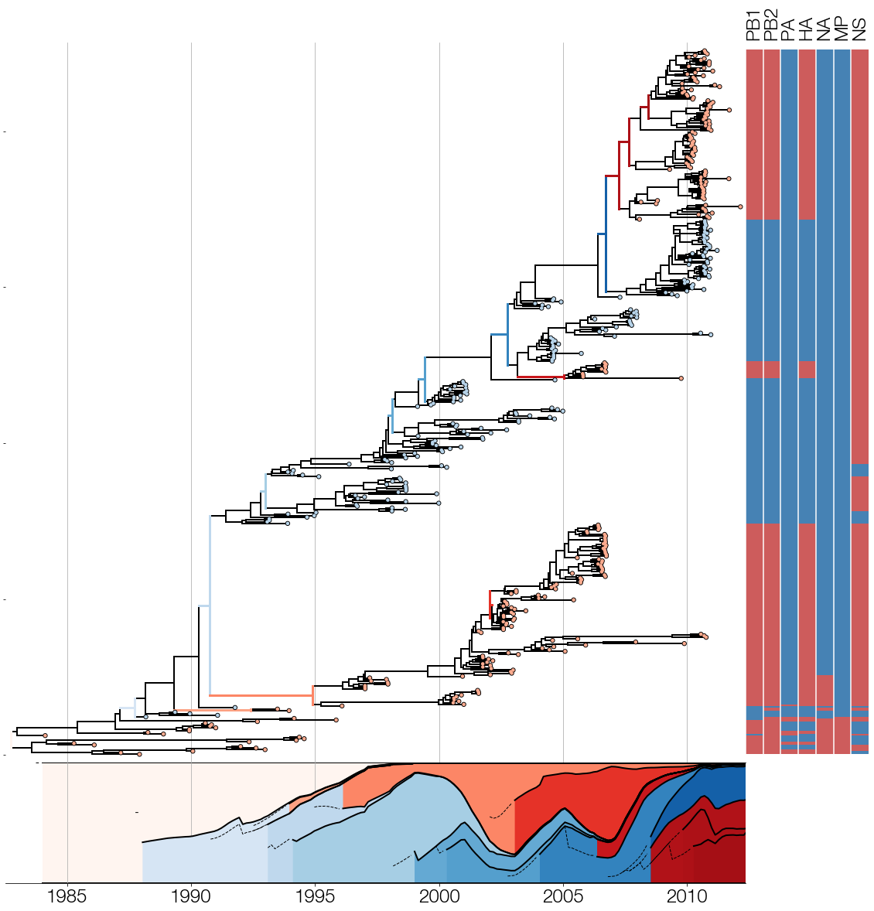
    


## Reticulate trees
-----------
Nicola Müller (formerly at ETH Zurich in Basel, now at Fred Hutch), Ugnė Stolz, Tim Vaughan, and Tanja Stadler (all based at ETH Zurich in Basel) have implemented [a reassortment algorithm](https://www.biorxiv.org/content/10.1101/726042v1) in BEAST2 which reconstructs clonal trees with reticulate edges. The next cell shows how to plot a summarised tree from these types of analyses in baltic.


```python
address='https://github.com/nicfel/Reassortment-Material/raw/master/Applications/InfB/combined/infB_sub2.summary.trees' ## address of example tree
fetch_tree = requests.get(address) ## fetch tree
treeFile=sio(fetch_tree.text) ## stream from repo copy

ret=bt.loadNexus(treeFile) ## treeFile here can alternatively be a path to a local file

ret.treeStats()

b_func=lambda k: 2
target=lambda k: isinstance(k,bt.reticulation)==False

fig = plt.subplots(figsize=(15,15),facecolor='w')

gs = GridSpec(1, 1,hspace=0.0,wspace=0.0)
ax = plt.subplot(gs[0])

posteriorCutoff=lambda k: k.traits['posterior']>0.75 if 'posterior' in k.traits else True

ret=ret.reduceTree(ret.getExternal(posteriorCutoff))

segNumber=0
for k in ret.Objects:
    k.traits['re']=0
    for trait in k.traits:
        if 'seg' in trait and trait not in ['segsCarried','segments']:
            s=int(trait.replace('seg',''))
            if s>segNumber:
                segNumber=s
print('%d segments'%(segNumber))
    
for k in sorted(ret.Objects,key=lambda w: w.height): ## iterate through branches, starting with oldest ones
    if hasattr(k,'contribution'): ## if branch is the result of reassortment
        subtree=ret.traverse_tree(k.children[-1],include_condition=lambda w:True) ## traverse the subtree, remembering every branch visited along the way
        for w in subtree: ## for every branch in subtree
            if posteriorCutoff(k.contribution): ## if it's a branch that passes a posterior threshold
                w.traits['re']=max([w.traits['re']+1,k.contribution.traits['re']+1]) ## increment on maximum reassortment number up to this point (increment either parent's or contribution's statistic)

cmap=mpl.cm.tab10_r
re_colours=['#A69F98','#3FA7D6','#AD5D4E','#FBB13C','#8C6057']
re_stat=lambda k: k.traits['re']
cn_func=lambda k: re_colours[re_stat(k)%len(re_colours)]

ret.plotTree(ax,target=target,x_attr=lambda k: k.absoluteTime,branchWidth=b_func,colour_function=cn_func)

for k in ret.Objects:
    if isinstance(k,bt.reticulation) and posteriorCutoff(k): ## dealing with reassortant branch
        segs=sorted(map(int,k.traits['segments'])) ## get travelling segment(s)
        c='k'
        size=30
        xp=k.parent.absoluteTime
        x=k.absoluteTime
        y=k.y
        
        for s in range(segNumber):
            fc='k' if s in segs else 'w'
            w=0.5
            seg=plt.Rectangle((ret.mostRecent+0.5+s*w,y-1),w,2,facecolor=fc,edgecolor='k',zorder=100)
            ax.add_patch(seg)
            if s==segNumber-1:
                ax.text(ret.mostRecent+0.5+s*w+w+0.2,y,'%.2f'%(k.traits['posterior']),size=14,ha='left',va='center')
            
        ax.plot([x,ret.mostRecent+0.5],[y,y],ls='--',lw=1,color=cn_func(k))
        
        ax.plot([xp,x,x],[y,y,k.target.y],color=cn_func(k),lw=2,ls='--',zorder=1) ## plot vertical lineage leaving donor and heading to recipient
        
        ax.scatter(x,k.target.y,s=size,facecolor='w',edgecolor='none',zorder=300) ## plot circles        
        ax.scatter(x,k.target.y,s=size*2.5,facecolor=cn_func(k.target.children[0]),edgecolor='none',zorder=299)

for k in ret.getExternal(lambda w: isinstance(w,bt.leaf)): ## iterate over branches
    y=k.y
    ax.scatter(k.absoluteTime,y,s=50,facecolor=cn_func(k),edgecolor='none',zorder=100)
    ax.scatter(k.absoluteTime,y,s=100,facecolor='k',edgecolor='none',zorder=99)

l,u=ret.root.traits['height_95%_HPD']
h=3
print('lower: %.2f \nmean: %.2f \nupper: %.2f \nmin tree height: %.2f \nmean tree height: %.2f \nmax tree height: %.2f'%(ret.mostRecent-u,k.absoluteTime,ret.mostRecent-l,u,ret.mostRecent-ret.root.absoluteTime,l))
confidence=plt.Rectangle((ret.mostRecent-u,ret.root.y-h/2),u-l,h,facecolor='k',edgecolor='none',alpha=0.2)
ax.add_patch(confidence)

[ax.spines[loc].set_visible(False) for loc in ax.spines if loc not in ['bottom']]
ax.tick_params(axis='y',size=0,labelsize=0)
ax.grid(axis='x',ls='-')
ax.set_xlim(left=1969)
ax.set_ylim(-1,ret.ySpan+1)

plt.show()
```

    
    Tree height: 45.996831
    Tree length: 459.262543
    multitype tree
    annotations present
    
    Numbers of objects in tree: 567 (311 nodes and 256 leaves)
    
    8 segments
    lower: 1971.72 
    mean: 2019.17 
    upper: 1974.65 
    min tree height: 47.45 
    mean tree height: 46.00 
    max tree height: 44.52


    
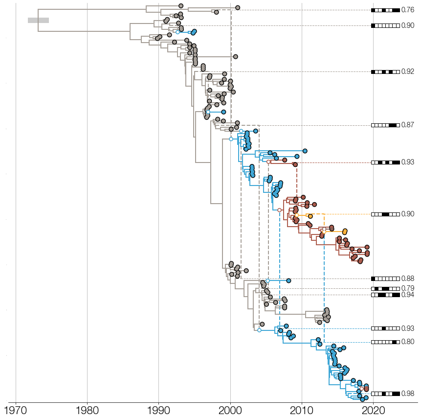
    


```python

```
